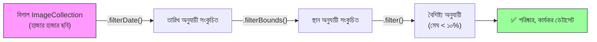

# ফিল্টারিং — আপনার প্রয়োজনীয় ডেটা খুঁজে বের করা (Filtering — Finding What You Need)

গুগল আর্থ ইঞ্জিনে ডেটাসেটগুলোতে প্রায়ই **হাজার হাজার ছবি** থাকে, যা দশকের পর দশক ধরে সংগৃহীত।
একটি **ফিল্টার** আপনাকে ঠিক যে ডেটা দরকার তা খুঁজে পেতে সাহায্য করে — তারিখ, স্থান, মেঘের পরিমাণ বা অন্য যেকোনো বৈশিষ্ট্য অনুযায়ী।

একটি লাইব্রেরিতে বই খোঁজার মতো ভাবুন। ক্যাটালগে লক্ষ বই আছে, কিন্তু আপনি শুধু ১৯৯০ সালের, ইংরেজি ভাষার, ভূগোল বিষয়ক বই চান।



---

## তিনটি অপরিহার্য ফিল্টার (The Three Essential Filters)

### ১. `.filterDate()` — সময় অনুযায়ী ফিল্টার

একটি নির্দিষ্ট তারিখ পরিসরে তোলা ছবি নির্বাচন করে।

=== "JavaScript"
    ```javascript
    var collection = ee.ImageCollection('LANDSAT/LC08/C02/T1_L2')
      .filterDate('2023-01-01', '2023-12-31');

    print('২০২৩ সালের ছবি:', collection.size());
    ```

=== "Python"
    ```python
    collection = ee.ImageCollection('LANDSAT/LC08/C02/T1_L2') \
        .filterDate('2023-01-01', '2023-12-31')

    print('২০২৩ সালের ছবি:', collection.size().getInfo())
    ```

---

### ২. `.filterBounds()` — স্থান অনুযায়ী ফিল্টার

শুধুমাত্র সেই ছবিগুলো নির্বাচন করে যা একটি নির্দিষ্ট জ্যামিতির (বিন্দু, বহুভুজ বা ফিচার) সাথে **ওভারল্যাপ** করে।

=== "JavaScript"
    ```javascript
    // অধ্যয়ন এলাকা — ভুবনেশ্বর, ওডিশা
    var point = ee.Geometry.Point([85.82, 20.30]);

    var collection = ee.ImageCollection('LANDSAT/LC08/C02/T1_L2')
      .filterDate('2023-01-01', '2023-12-31')
      .filterBounds(point);

    print('ভুবনেশ্বরের উপর ছবি:', collection.size());
    ```

=== "Python"
    ```python
    # অধ্যয়ন এলাকা — ভুবনেশ্বর, ওডিশা
    point = ee.Geometry.Point([85.82, 20.30])

    collection = ee.ImageCollection('LANDSAT/LC08/C02/T1_L2') \
        .filterDate('2023-01-01', '2023-12-31') \
        .filterBounds(point)

    print('ভুবনেশ্বরের উপর ছবি:', collection.size().getInfo())
    ```

---

### ৩. `.filter()` — যেকোনো বৈশিষ্ট্য অনুযায়ী ফিল্টার

সবচেয়ে নমনীয় ফিল্টার। যেকোনো ইমেজ মেটাডেটা বৈশিষ্ট্য লক্ষ্য করতে `ee.Filter` ব্যবহার করে।

=== "JavaScript"
    ```javascript
    var collection = ee.ImageCollection('LANDSAT/LC08/C02/T1_L2')
      .filterDate('2023-01-01', '2023-12-31')
      .filterBounds(ee.Geometry.Point([85.82, 20.30]))
      .filter(ee.Filter.lt('CLOUD_COVER', 10)); // ১০%-এর কম মেঘ

    print('কম মেঘের ছবি:', collection.size());
    ```

=== "Python"
    ```python
    collection = ee.ImageCollection('LANDSAT/LC08/C02/T1_L2') \
        .filterDate('2023-01-01', '2023-12-31') \
        .filterBounds(ee.Geometry.Point([85.82, 20.30])) \
        .filter(ee.Filter.lt('CLOUD_COVER', 10))

    print('কম মেঘের ছবি:', collection.size().getInfo())
    ```

---

## সাধারণ `ee.Filter` পদ্ধতিসমূহ

| ফিল্টার পদ্ধতি | কী করে | উদাহরণ |
| :--- | :--- | :--- |
| `ee.Filter.lt(prop, val)` | এর চেয়ে কম | মেঘের পরিমাণ < ২০% |
| `ee.Filter.gt(prop, val)` | এর চেয়ে বেশি | NDVI > ০.৩ |
| `ee.Filter.eq(prop, val)` | সমান | WRS_PATH = ১৪২ |
| `ee.Filter.bounds(geometry)` | জ্যামিতির সাথে মিলে | আপনার অধ্যয়ন এলাকার মধ্যে |
| `ee.Filter.date(start, end)` | তারিখের পরিসর | দুটি তারিখের মধ্যে |
| `ee.Filter.calendarRange(1,3,'month')` | মাস/ঋতু অনুযায়ী | জানুয়ারি থেকে মার্চ |

---

## ফিল্টার একত্রিত করা (Combining Filters)

আপনি ফিল্টারগুলো পর পর চেইন করতে বা `And`/`Or` দিয়ে যৌগিক করতে পারেন।

=== "JavaScript"
    ```javascript
    // চেইন: প্রতিটি .filter() ডেটা আরও সংকুচিত করে (AND লজিক)
    var clean = ee.ImageCollection('COPERNICUS/S2_SR_HARMONIZED')
      .filterDate('2023-06-01', '2023-09-30')
      .filterBounds(ee.Geometry.Point([85.82, 20.30]))
      .filter(ee.Filter.lt('CLOUDY_PIXEL_PERCENTAGE', 5));

    print('মৌসুমী সেন্টিনেল-২ (< ৫% মেঘ):', clean.size());
    ```

=== "Python"
    ```python
    # চেইন: প্রতিটি .filter() ডেটা আরও সংকুচিত করে
    clean = ee.ImageCollection('COPERNICUS/S2_SR_HARMONIZED') \
        .filterDate('2023-06-01', '2023-09-30') \
        .filterBounds(ee.Geometry.Point([85.82, 20.30])) \
        .filter(ee.Filter.lt('CLOUDY_PIXEL_PERCENTAGE', 5))

    print('ফলাফল:', clean.size().getInfo())
    ```

---

## বাস্তব উদাহরণ: মৌসুমী বিশ্লেষণ (Real-World Example)

একটি জলাশয়ের শুষ্ক মৌসুমের (নভেম্বর–মার্চ) মেঘমুক্ত ল্যান্ডস্যাট ছবি পাওয়া:

=== "JavaScript"
    ```javascript
    var watershed = ee.Geometry.Polygon([
      [[85.5, 20.1], [85.5, 20.6], [86.1, 20.6], [86.1, 20.1]]
    ]);

    var drySeason = ee.ImageCollection('LANDSAT/LC08/C02/T1_L2')
      .filterDate('2022-11-01', '2023-03-31')
      .filterBounds(watershed)
      .filter(ee.Filter.lt('CLOUD_COVER', 15))
      .filter(ee.Filter.calendarRange(11, 3, 'month'));

    print('শুষ্ক মৌসুমের ছবি:', drySeason.size());
    Map.centerObject(watershed, 10);
    Map.addLayer(drySeason.median(), {
      bands: ['SR_B4', 'SR_B3', 'SR_B2'],
      min: 7000, max: 30000
    }, 'শুষ্ক মৌসুম কম্পোজিট');
    ```

=== "Python"
    ```python
    watershed = ee.Geometry.Polygon([[
        [85.5, 20.1], [85.5, 20.6], [86.1, 20.6], [86.1, 20.1]
    ]])

    dry_season = ee.ImageCollection('LANDSAT/LC08/C02/T1_L2') \
        .filterDate('2022-11-01', '2023-03-31') \
        .filterBounds(watershed) \
        .filter(ee.Filter.lt('CLOUD_COVER', 15)) \
        .filter(ee.Filter.calendarRange(11, 3, 'month'))

    print('শুষ্ক মৌসুমের ছবি:', dry_season.size().getInfo())
    ```

---

!!! tip "সবসময় আগে ফিল্টার করুন!"
    সবসময় যেকোনো গণনার **আগে** `.filterDate()` এবং `.filterBounds()` প্রয়োগ করুন। এতে আর্থ ইঞ্জিনকে কম ডেটা প্রক্রিয়া করতে হয় এবং মেমোরি বা টাইমআউট ত্রুটি এড়ানো যায়।

!!! warning "ফিল্টার ≠ ক্লিপ (Filter ≠ Clip)"
    `.filterBounds()` শুধু সেই ছবিগুলো নির্বাচন করে যা আপনার এলাকার সাথে **ওভারল্যাপ** করে — ছবিগুলো এখনও তাদের পূর্ণ আসল আকারেই থাকে। ছবিকে আপনার নির্দিষ্ট সীমানায় কাটতে, ফিল্টারের **পরে** `.clip()` ব্যবহার করুন।
