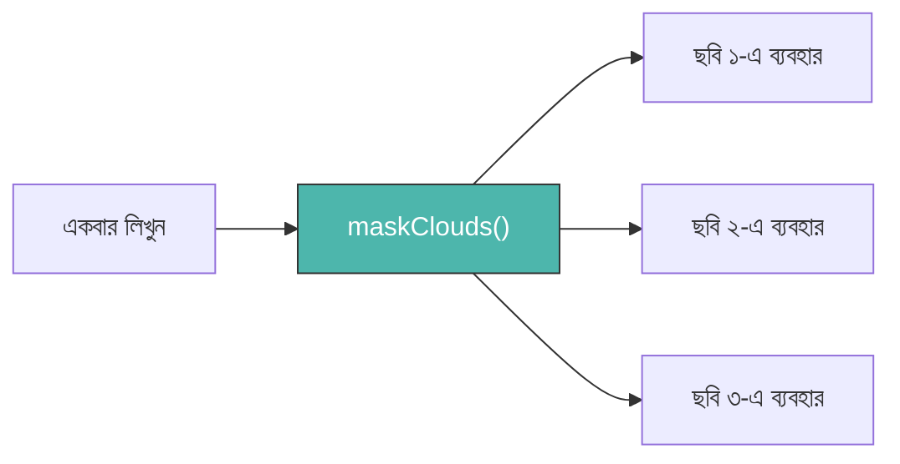
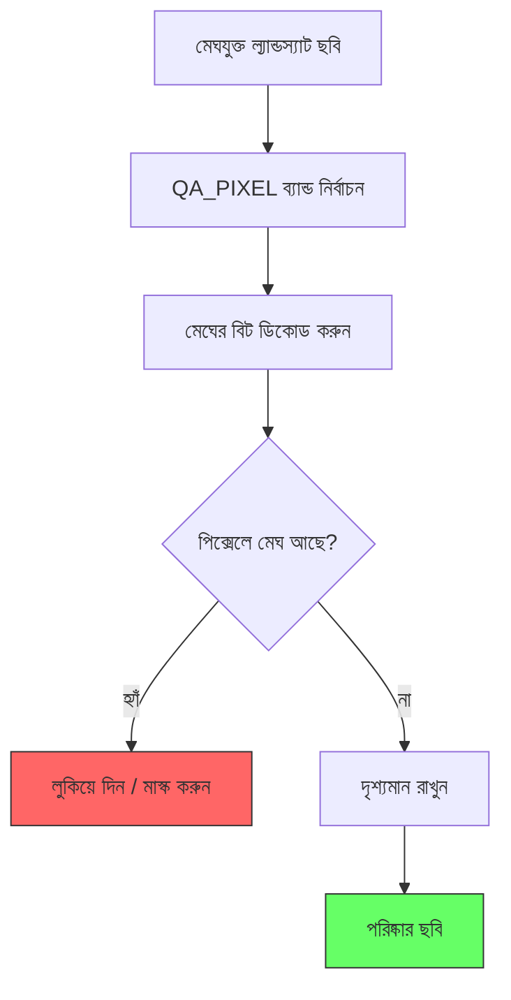

# কাস্টম ফাংশন — পুনঃব্যবহারযোগ্য সরঞ্জাম তৈরি করা (Custom Functions — Writing Reusable Tools)

একটি **ফাংশন (Function)** হলো কোডের একটি নামযুক্ত ব্লক যা একটি নির্দিষ্ট কাজ করে।
একই লজিক ১০ বার কপি-পেস্ট করার পরিবর্তে, আপনি এটি একবার ফাংশন হিসেবে লিখুন এবং যখনই দরকার হয় ডাকুন।



---

## কেন কাস্টম ফাংশন লিখবেন? (Why Write Custom Functions?)

| ফাংশন ছাড়া | ফাংশন দিয়ে |
| :--- | :--- |
| বারবার কোড কপি-পেস্ট করতে হয় | একবার লিখুন, সব জায়গায় ব্যবহার করুন |
| বাগ ঠিক করা কঠিন (১০ জায়গায় পরিবর্তন) | এক জায়গায় ঠিক করলেই সব ঠিক হয় |
| দীর্ঘ, জটিল স্ক্রিপ্ট | পরিষ্কার, পঠনযোগ্য কোড |
| `.map()` দিয়ে কালেকশনে ব্যবহার করা যায় না | কালেকশন প্রক্রিয়াকরণের জন্য অপরিহার্য |

---

## ফাংশনের গঠন (The Anatomy of a Function)

=== "JavaScript"
    ```javascript
    // গঠন:
    // var functionName = function(input) {
    //   // input দিয়ে যা করবেন
    //   return result;
    // };

    var addTen = function(number) {
      var result = number + 10;
      return result;
    };

    // ফাংশন কল করা
    print(addTen(5));  // আউটপুট: 15
    print(addTen(20)); // আউটপুট: 30
    ```

=== "Python"
    ```python
    # গঠন:
    # def function_name(input):
    #     # input দিয়ে যা করবেন
    #     return result

    def add_ten(number):
        result = number + 10
        return result

    # ফাংশন কল করা
    print(add_ten(5))   # আউটপুট: 15
    print(add_ten(20))  # আউটপুট: 30
    ```

---

## বাস্তব GEE উদাহরণ: ক্লাউড মাস্কিং (Real GEE Example: Cloud Masking)

আর্থ ইঞ্জিনে সবচেয়ে পরিচিত কাস্টম ফাংশন — ল্যান্ডস্যাট ছবি থেকে মেঘ সরানো।



=== "JavaScript"
    ```javascript
    // ক্লাউড মাস্কিং ফাংশন সংজ্ঞায়িত করুন
    var maskLandsatClouds = function(image) {
      // QA_PIXEL ব্যান্ড মেঘের তথ্য বাইনারি বিট হিসেবে এনকোড করে
      var qa = image.select('QA_PIXEL');

      // বিট ৩ = মেঘের ছায়া, বিট ৪ = মেঘ
      var cloudShadow = qa.bitwiseAnd(1 << 3).eq(0);
      var cloud       = qa.bitwiseAnd(1 << 4).eq(0);

      // শুধুমাত্র সেই পিক্সেলগুলো রাখুন যেখানে উভয় শর্ত সত্য
      return image.updateMask(cloudShadow.and(cloud));
    };

    // একটি একক ছবিতে ফাংশনটি প্রয়োগ করুন
    var rawImage = ee.ImageCollection('LANDSAT/LC08/C02/T1_L2')
      .filterDate('2023-01-01', '2023-12-31')
      .filterBounds(ee.Geometry.Point([85.82, 20.30]))
      .first();

    var cleanImage = maskLandsatClouds(rawImage);
    Map.addLayer(cleanImage, {bands: ['SR_B4','SR_B3','SR_B2'], min:7000, max:30000}, 'পরিষ্কার ছবি');
    ```

=== "Python"
    ```python
    # ক্লাউড মাস্কিং ফাংশন সংজ্ঞায়িত করুন
    def mask_landsat_clouds(image):
        qa = image.select('QA_PIXEL')
        cloud_shadow = qa.bitwiseAnd(1 << 3).eq(0)
        cloud        = qa.bitwiseAnd(1 << 4).eq(0)
        return image.updateMask(cloud_shadow.And(cloud))

    raw_image = ee.ImageCollection('LANDSAT/LC08/C02/T1_L2') \
        .filterDate('2023-01-01', '2023-12-31') \
        .filterBounds(ee.Geometry.Point([85.82, 20.30])) \
        .first()

    clean_image = mask_landsat_clouds(raw_image)
    ```

---

## উদাহরণ ২: NDVI ব্যান্ড যোগ করা (Example 2: Adding an NDVI Band)

একটি পুনঃব্যবহারযোগ্য ফাংশন যা NDVI গণনা করে এবং একটি নতুন ব্যান্ড হিসেবে যুক্ত করে।

=== "JavaScript"
    ```javascript
    var addNDVI = function(image) {
      // NDVI = (NIR - লাল) / (NIR + লাল)
      // ল্যান্ডস্যাট ৮: NIR = SR_B5, লাল = SR_B4
      var ndvi = image.normalizedDifference(['SR_B5', 'SR_B4'])
                      .rename('NDVI');
      return image.addBands(ndvi);
    };

    var image = ee.ImageCollection('LANDSAT/LC08/C02/T1_L2')
      .filterDate('2023-01-01', '2023-12-31')
      .filterBounds(ee.Geometry.Point([85.82, 20.30]))
      .first();

    var imageWithNDVI = addNDVI(image);
    print('NDVI যোগের পর ব্যান্ডগুলো:', imageWithNDVI.bandNames());
    ```

=== "Python"
    ```python
    def add_ndvi(image):
        ndvi = image.normalizedDifference(['SR_B5', 'SR_B4']) \
                    .rename('NDVI')
        return image.addBands(ndvi)

    image = ee.ImageCollection('LANDSAT/LC08/C02/T1_L2') \
        .filterDate('2023-01-01', '2023-12-31') \
        .filterBounds(ee.Geometry.Point([85.82, 20.30])) \
        .first()

    image_with_ndvi = add_ndvi(image)
    print('ব্যান্ডসমূহ:', image_with_ndvi.bandNames().getInfo())
    ```

---

## দুটি একত্রিত করা: মাস্ক + NDVI (Combining Both)

=== "JavaScript"
    ```javascript
    var collection = ee.ImageCollection('LANDSAT/LC08/C02/T1_L2')
      .filterDate('2023-01-01', '2023-12-31')
      .filterBounds(ee.Geometry.Point([85.82, 20.30]))
      .map(maskLandsatClouds)  // সব ছবিতে ক্লাউড মাস্ক
      .map(addNDVI);           // তারপর সব ছবিতে NDVI যোগ

    var median = collection.median();
    Map.addLayer(median.select('NDVI'), {min: 0, max: 0.8, palette: ['red','yellow','green']}, 'NDVI');
    ```

=== "Python"
    ```python
    collection = ee.ImageCollection('LANDSAT/LC08/C02/T1_L2') \
        .filterDate('2023-01-01', '2023-12-31') \
        .filterBounds(ee.Geometry.Point([85.82, 20.30])) \
        .map(mask_landsat_clouds) \
        .map(add_ndvi)

    print('প্রক্রিয়াকৃত আকার:', collection.size().getInfo())
    ```

---

!!! tip "এক ফাংশন, এক কাজ (One Function, One Job)"
    প্রতিটি ফাংশন একটি মাত্র কাজে মনোযোগ দিন। `maskClouds()` শুধু মেঘ সরাবে। `addNDVI()` শুধু NDVI যোগ করবে। এতে কোড পড়তে, পরীক্ষা করতে এবং পুনরায় ব্যবহার করতে সহজ হয়।

!!! info "ফাংশন বনাম বিল্ট-ইন মেথড"
    GEE-এ অনেক বিল্ট-ইন মেথড আছে যেমন `.normalizedDifference()`, `.median()`, `.clip()`। আপনি **কাস্টম ফাংশন** লিখবেন যখন আপনাকে সেই বিল্ট-ইনগুলো নিজের লজিক দিয়ে একত্রিত বা প্রসারিত করতে হবে।
