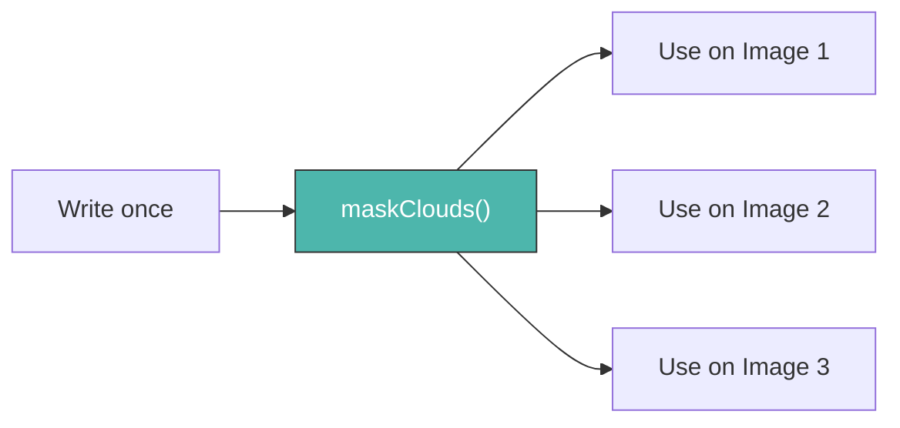
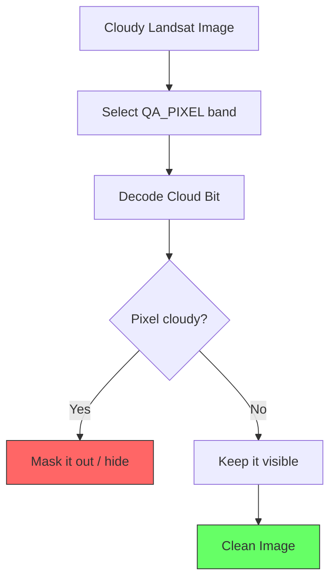

# Custom Functions — Writing Reusable Tools

A **function** is a named block of code that performs one specific task.
Instead of copying and pasting the same logic 10 times, you write it once as a function and call it whenever you need it.



---

## Why Write Custom Functions?

| Without Functions | With Functions |
| :--- | :--- |
| Copy-paste code repeatedly | Write once, reuse everywhere |
| Hard to fix bugs (change in 10 places) | Fix in one place, fixed everywhere |
| Long, messy scripts | Clean, readable code |
| Can't use with `.map()` for collections | Essential for processing collections |

---

## The Anatomy of a Function

=== "JavaScript"
    ```javascript
    // Structure:
    // var functionName = function(input) {
    //   // do something with input
    //   return result;
    // };

    var addTen = function(number) {
      var result = number + 10;
      return result;
    };

    // Calling the function
    print(addTen(5));  // Output: 15
    print(addTen(20)); // Output: 30
    ```

=== "Python"
    ```python
    # Structure:
    # def function_name(input):
    #     # do something with input
    #     return result

    def add_ten(number):
        result = number + 10
        return result

    # Calling the function
    print(add_ten(5))   # Output: 15
    print(add_ten(20))  # Output: 30
    ```

---

## Real GEE Example: Cloud Masking

The most common custom function in Earth Engine — removing clouds from Landsat imagery.



=== "JavaScript"
    ```javascript
    // Define the cloud masking function
    var maskLandsatClouds = function(image) {
      // The QA_PIXEL band encodes cloud information as binary bits
      var qa = image.select('QA_PIXEL');

      // Bit 3 = Cloud shadow, Bit 4 = Cloud
      var cloudShadow = qa.bitwiseAnd(1 << 3).eq(0);
      var cloud       = qa.bitwiseAnd(1 << 4).eq(0);

      // Only keep pixels where BOTH conditions are true
      return image.updateMask(cloudShadow.and(cloud));
    };

    // Apply the function to a single image
    var rawImage = ee.ImageCollection('LANDSAT/LC08/C02/T1_L2')
      .filterDate('2023-01-01', '2023-12-31')
      .filterBounds(ee.Geometry.Point([85.82, 20.30]))
      .first();

    var cleanImage = maskLandsatClouds(rawImage);
    Map.addLayer(cleanImage, {bands: ['SR_B4','SR_B3','SR_B2'], min:7000, max:30000}, 'Clean Image');
    ```

=== "Python"
    ```python
    # Define the cloud masking function
    def mask_landsat_clouds(image):
        # The QA_PIXEL band encodes cloud information as binary bits
        qa = image.select('QA_PIXEL')

        # Bit 3 = Cloud shadow, Bit 4 = Cloud
        cloud_shadow = qa.bitwiseAnd(1 << 3).eq(0)
        cloud        = qa.bitwiseAnd(1 << 4).eq(0)

        # Only keep pixels where BOTH conditions are true
        return image.updateMask(cloud_shadow.And(cloud))

    # Apply to a single image
    raw_image = ee.ImageCollection('LANDSAT/LC08/C02/T1_L2') \
        .filterDate('2023-01-01', '2023-12-31') \
        .filterBounds(ee.Geometry.Point([85.82, 20.30])) \
        .first()

    clean_image = mask_landsat_clouds(raw_image)
    ```

---

## Example 2: Adding an NDVI Band

A reusable function that calculates Normalized Difference Vegetation Index (NDVI) and appends it as a new band.

=== "JavaScript"
    ```javascript
    var addNDVI = function(image) {
      // NDVI = (NIR - Red) / (NIR + Red)
      // Landsat 8: NIR = SR_B5, Red = SR_B4
      var ndvi = image.normalizedDifference(['SR_B5', 'SR_B4'])
                      .rename('NDVI');
      return image.addBands(ndvi);
    };

    // Test on a single image
    var image = ee.ImageCollection('LANDSAT/LC08/C02/T1_L2')
      .filterDate('2023-01-01', '2023-12-31')
      .filterBounds(ee.Geometry.Point([85.82, 20.30]))
      .first();

    var imageWithNDVI = addNDVI(image);
    print('Bands after adding NDVI:', imageWithNDVI.bandNames());
    ```

=== "Python"
    ```python
    def add_ndvi(image):
        # NDVI = (NIR - Red) / (NIR + Red)
        # Landsat 8: NIR = SR_B5, Red = SR_B4
        ndvi = image.normalizedDifference(['SR_B5', 'SR_B4']) \
                    .rename('NDVI')
        return image.addBands(ndvi)

    # Test on a single image
    image = ee.ImageCollection('LANDSAT/LC08/C02/T1_L2') \
        .filterDate('2023-01-01', '2023-12-31') \
        .filterBounds(ee.Geometry.Point([85.82, 20.30])) \
        .first()

    image_with_ndvi = add_ndvi(image)
    print('Bands:', image_with_ndvi.bandNames().getInfo())
    ```

---

## Combining Both: Mask + NDVI

=== "JavaScript"
    ```javascript
    var collection = ee.ImageCollection('LANDSAT/LC08/C02/T1_L2')
      .filterDate('2023-01-01', '2023-12-31')
      .filterBounds(ee.Geometry.Point([85.82, 20.30]))
      .map(maskLandsatClouds)  // Apply cloud mask to ALL images
      .map(addNDVI);           // Then add NDVI to ALL images

    print('Processed collection size:', collection.size());
    var median = collection.median();
    Map.addLayer(median.select('NDVI'), {min: 0, max: 0.8, palette: ['red','yellow','green']}, 'NDVI');
    ```

=== "Python"
    ```python
    collection = ee.ImageCollection('LANDSAT/LC08/C02/T1_L2') \
        .filterDate('2023-01-01', '2023-12-31') \
        .filterBounds(ee.Geometry.Point([85.82, 20.30])) \
        .map(mask_landsat_clouds) \
        .map(add_ndvi)

    print('Processed size:', collection.size().getInfo())
    ```

---

!!! tip "One Function, One Job"
    Keep each function focused on a single task. `maskClouds()` only masks clouds. `addNDVI()` only adds NDVI. This makes your code easy to read, test, and reuse.

!!! info "Functions vs Built-in Methods"
    GEE has many built-in methods like `.normalizedDifference()`, `.median()`, `.clip()`. You write **custom functions** whenever you need to combine or extend those built-ins with your own logic.
