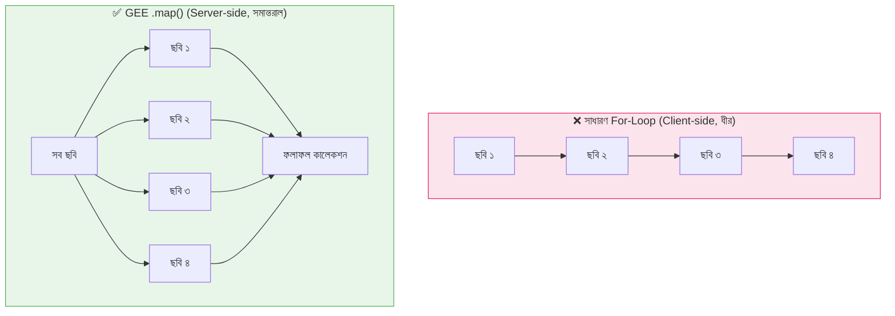

# `.map()` ফাংশন — আর্থ ইঞ্জিনের অ্যাসেম্বলি লাইন (Earth Engine's Assembly Line)

সাধারণ প্রোগ্রামিংয়ে, একটি `for` লুপ আইটেমগুলো **একটি একটি করে, আপনার কম্পিউটারে** প্রক্রিয়া করে।
গুগল আর্থ ইঞ্জিনে, `.map()` প্রতিটি আইটেম **গুগলের সার্ভারে সমান্তরালভাবে** প্রক্রিয়ার জন্য পাঠায়।

এই মৌলিক পার্থক্যই আর্থ ইঞ্জিনকে এত শক্তিশালী করে তোলে।



---

## `.map()` কীভাবে কাজ করে (How `.map()` Works)

আপনি `.map()`-কে একটি **ফাংশন** দেন, এবং এটি সেই ফাংশনটি কালেকশনের **প্রতিটি ছবিতে** একসাথে প্রয়োগ করে।

ফাংশনটি অবশ্যই:
১. একটি **একক ছবি** ইনপুট হিসেবে গ্রহণ করবে
২. একটি **একক ছবি** আউটপুট হিসেবে ফেরত দেবে

=== "JavaScript"
    ```javascript
    // ধাপ ১: আপনার ফাংশন সংজ্ঞায়িত করুন (ছবি ভেতরে → ছবি বাইরে)
    var addNDVI = function(image) {
      var ndvi = image.normalizedDifference(['SR_B5', 'SR_B4']).rename('NDVI');
      return image.addBands(ndvi);
    };

    // ধাপ ২: আপনার কালেকশন লোড করুন
    var collection = ee.ImageCollection('LANDSAT/LC08/C02/T1_L2')
      .filterDate('2023-01-01', '2023-12-31')
      .filterBounds(ee.Geometry.Point([85.82, 20.30]));

    // ধাপ ৩: একসাথে সব ছবিতে ফাংশন প্রয়োগ করুন
    var withNDVI = collection.map(addNDVI);

    print('map-এর পরের ব্যান্ড:', withNDVI.first().bandNames());
    ```

=== "Python"
    ```python
    # ধাপ ১: আপনার ফাংশন সংজ্ঞায়িত করুন
    def add_ndvi(image):
        ndvi = image.normalizedDifference(['SR_B5', 'SR_B4']).rename('NDVI')
        return image.addBands(ndvi)

    # ধাপ ২: আপনার কালেকশন লোড করুন
    collection = ee.ImageCollection('LANDSAT/LC08/C02/T1_L2') \
        .filterDate('2023-01-01', '2023-12-31') \
        .filterBounds(ee.Geometry.Point([85.82, 20.30]))

    # ধাপ ৩: একসাথে সব ছবিতে ফাংশন প্রয়োগ করুন
    with_ndvi = collection.map(add_ndvi)
    print('map-এর পরের ব্যান্ড:', with_ndvi.first().bandNames().getInfo())
    ```

---

## বাস্তব উদাহরণ ১: পুরো কালেকশনের ক্লাউড মাস্কিং

`.map()` ছাড়া আপনাকে প্রতিটি ছবির জন্য আলাদাভাবে `maskClouds(image1)`, `maskClouds(image2)` ইত্যাদি ডাকতে হতো। `.map()` দিয়ে একটি লাইনেই সব হয়ে যায়।

=== "JavaScript"
    ```javascript
    var maskClouds = function(image) {
      var qa = image.select('QA_PIXEL');
      var mask = qa.bitwiseAnd(1 << 4).eq(0); // মেঘ সরান (বিট ৪)
      return image.updateMask(mask);
    };

    // হাজার হাজার ছবিতে এক লাইনে প্রয়োগ!
    var cleanCollection = ee.ImageCollection('LANDSAT/LC08/C02/T1_L2')
      .filterDate('2020-01-01', '2023-12-31')
      .filterBounds(ee.Geometry.Point([85.82, 20.30]))
      .map(maskClouds);

    // মেঘমুক্ত কম্পোজিট তৈরি করুন
    var composite = cleanCollection.median();
    Map.centerObject(ee.Geometry.Point([85.82, 20.30]), 10);
    Map.addLayer(composite, {bands: ['SR_B4','SR_B3','SR_B2'], min:7000, max:30000}, 'মেঘমুক্ত কম্পোজিট');
    ```

=== "Python"
    ```python
    def mask_clouds(image):
        qa = image.select('QA_PIXEL')
        mask = qa.bitwiseAnd(1 << 4).eq(0)
        return image.updateMask(mask)

    clean_collection = ee.ImageCollection('LANDSAT/LC08/C02/T1_L2') \
        .filterDate('2020-01-01', '2023-12-31') \
        .filterBounds(ee.Geometry.Point([85.82, 20.30])) \
        .map(mask_clouds)

    composite = clean_collection.median()
    ```

---

## বাস্তব উদাহরণ ২: সময়ের সাথে পানির এলাকা হিসাব করা

`.map()` কালেকশনের **প্রতিটি ছবির** জন্য পানির পৃষ্ঠের আয়তন গণনা করে এবং ফলাফল একটি প্রপার্টি হিসেবে ট্যাগ করে — যা টাইম-সিরিজ চার্টের জন্য উপযুক্ত।

=== "JavaScript"
    ```javascript
    var studyArea = ee.Geometry.Rectangle([85.5, 20.1, 86.1, 20.6]);

    var addWaterArea = function(image) {
      // NDWI > 0.15 = পানি
      var water = image.normalizedDifference(['B3', 'B8']).gt(0.15);

      // কিমি²-তে আয়তন গণনা
      var area = water.multiply(ee.Image.pixelArea())
                      .reduceRegion({
                        reducer: ee.Reducer.sum(),
                        geometry: studyArea,
                        scale: 10,
                        maxPixels: 1e9
                      });

      var areaKm2 = ee.Number(area.get('nd')).divide(1e6);
      return image.set('water_area_km2', areaKm2);
    };

    var s2 = ee.ImageCollection('COPERNICUS/S2_SR_HARMONIZED')
      .filterDate('2023-01-01', '2023-12-31')
      .filterBounds(studyArea)
      .filter(ee.Filter.lt('CLOUDY_PIXEL_PERCENTAGE', 10))
      .map(addWaterArea);

    // এখন প্রতিটি ছবিতে 'water_area_km2' প্রপার্টি আছে — চার্টের জন্য প্রস্তুত!
    ```

=== "Python"
    ```python
    study_area = ee.Geometry.Rectangle([85.5, 20.1, 86.1, 20.6])

    def add_water_area(image):
        water = image.normalizedDifference(['B3', 'B8']).gt(0.15)
        area = water.multiply(ee.Image.pixelArea()) \
                    .reduceRegion(
                        reducer=ee.Reducer.sum(),
                        geometry=study_area,
                        scale=10,
                        maxPixels=1e9
                    )
        area_km2 = ee.Number(area.get('nd')).divide(1e6)
        return image.set('water_area_km2', area_km2)

    s2 = ee.ImageCollection('COPERNICUS/S2_SR_HARMONIZED') \
        .filterDate('2023-01-01', '2023-12-31') \
        .filterBounds(study_area) \
        .filter(ee.Filter.lt('CLOUDY_PIXEL_PERCENTAGE', 10)) \
        .map(add_water_area)
    ```

---

## `.map()` বনাম `for` লুপ — কোনটি কখন ব্যবহার করবেন

| পরিস্থিতি | `.map()` ব্যবহার | `for` লুপ ব্যবহার |
| :--- | :--- | :--- |
| স্যাটেলাইট ছবি প্রক্রিয়াকরণ | ✅ সবসময় | ❌ কখনই না |
| Python-এর স্ট্রিং লিস্টে লুপ | ❌ | ✅ |
| একটি FeatureCollection-এ ফাংশন প্রয়োগ | ✅ | ❌ |
| Client-side সংখ্যার লিস্টে লুপ | ❌ | ✅ |

!!! danger "GEE কালেকশনে কখনই `for` লুপ ব্যবহার করবেন না"
    `ImageCollection`-এ Python/JS `for` লুপ দিয়ে লুপ করার চেষ্টা করলে হয় ব্যর্থ হবে অথবা পুরো কালেকশন আপনার কম্পিউটারে ডাউনলোড হতে থাকবে — যা অসম্ভব ধীর। সবসময় `.map()` ব্যবহার করুন।

!!! tip "ফাংশনকে একই ধরনের আউটপুট দিতে হবে"
    যদি আপনার কালেকশনে `ee.Image` অবজেক্ট থাকে, তবে আপনার `.map()` ফাংশনকেও একটি **`ee.Image` ফেরত দিতে হবে**। অন্য কিছু ফেরত দিলে ত্রুটি হবে।
