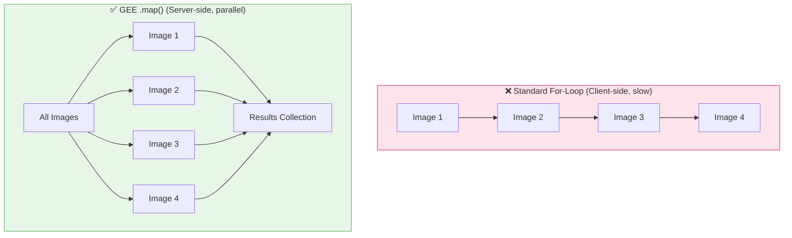

# The `.map()` Function — Earth Engine's Assembly Line

In standard programming, a `for` loop processes items **one by one, on your computer**.
In Google Earth Engine, `.map()` sends each item to **Google's servers to be processed in parallel**.

This is the fundamental difference that makes Earth Engine powerful.



---

## How `.map()` Works

You provide `.map()` with a **function**, and it applies that function to **every image** in a collection simultaneously.

The function must:

1. Accept a **single image** as input
2. Return a **single image** as output

=== "JavaScript"
    ```javascript
    // Step 1: Define your function (image in → image out)
    var addNDVI = function(image) {
      var ndvi = image.normalizedDifference(['SR_B5', 'SR_B4']).rename('NDVI');
      return image.addBands(ndvi);
    };

    // Step 2: Load your collection
    var collection = ee.ImageCollection('LANDSAT/LC08/C02/T1_L2')
      .filterDate('2023-01-01', '2023-12-31')
      .filterBounds(ee.Geometry.Point([85.82, 20.30]));

    // Step 3: Apply the function to every image at once
    var withNDVI = collection.map(addNDVI);

    print('Original bands:', collection.first().bandNames());
    print('After map bands:', withNDVI.first().bandNames());
    ```

=== "Python"
    ```python
    # Step 1: Define your function (image in → image out)
    def add_ndvi(image):
        ndvi = image.normalizedDifference(['SR_B5', 'SR_B4']).rename('NDVI')
        return image.addBands(ndvi)

    # Step 2: Load your collection
    collection = ee.ImageCollection('LANDSAT/LC08/C02/T1_L2') \
        .filterDate('2023-01-01', '2023-12-31') \
        .filterBounds(ee.Geometry.Point([85.82, 20.30]))

    # Step 3: Apply the function to every image at once
    with_ndvi = collection.map(add_ndvi)

    print('After map bands:', with_ndvi.first().bandNames().getInfo())
    ```

---

## Real-World Example 1: Cloud Masking an Entire Collection

Without `.map()`, you'd have to manually call `maskClouds(image1)`, `maskClouds(image2)`, etc. for every image. With `.map()`, one line does it all.

=== "JavaScript"
    ```javascript
    var maskClouds = function(image) {
      var qa = image.select('QA_PIXEL');
      var mask = qa.bitwiseAnd(1 << 4).eq(0); // Remove clouds (bit 4)
      return image.updateMask(mask);
    };

    // Apply to thousands of images in one line!
    var cleanCollection = ee.ImageCollection('LANDSAT/LC08/C02/T1_L2')
      .filterDate('2020-01-01', '2023-12-31')
      .filterBounds(ee.Geometry.Point([85.82, 20.30]))
      .map(maskClouds);

    // Create a cloud-free composite
    var composite = cleanCollection.median();
    Map.centerObject(ee.Geometry.Point([85.82, 20.30]), 10);
    Map.addLayer(composite, {bands: ['SR_B4','SR_B3','SR_B2'], min:7000, max:30000}, 'Cloud-Free Composite');
    ```

=== "Python"
    ```python
    def mask_clouds(image):
        qa = image.select('QA_PIXEL')
        mask = qa.bitwiseAnd(1 << 4).eq(0)
        return image.updateMask(mask)

    # Apply to thousands of images in one line!
    clean_collection = ee.ImageCollection('LANDSAT/LC08/C02/T1_L2') \
        .filterDate('2020-01-01', '2023-12-31') \
        .filterBounds(ee.Geometry.Point([85.82, 20.30])) \
        .map(mask_clouds)

    composite = clean_collection.median()
    ```

---

## Real-World Example 2: Calculating Water Area Over Time

Here `.map()` computes the water surface area for **each image** in a collection and tags the result as a property — enabling a time-series chart.

=== "JavaScript"
    ```javascript
    var studyArea = ee.Geometry.Rectangle([85.5, 20.1, 86.1, 20.6]);

    var addWaterArea = function(image) {
      // NDWI > 0.15 = water
      var water = image.normalizedDifference(['B3', 'B8']).gt(0.15);

      // Calculate area in km²
      var area = water.multiply(ee.Image.pixelArea())
                      .reduceRegion({
                        reducer: ee.Reducer.sum(),
                        geometry: studyArea,
                        scale: 10,
                        maxPixels: 1e9
                      });

      var areaKm2 = ee.Number(area.get('nd')).divide(1e6);
      return image.set('water_area_km2', areaKm2);
    };

    var s2 = ee.ImageCollection('COPERNICUS/S2_SR_HARMONIZED')
      .filterDate('2023-01-01', '2023-12-31')
      .filterBounds(studyArea)
      .filter(ee.Filter.lt('CLOUDY_PIXEL_PERCENTAGE', 10))
      .map(addWaterArea);

    // Now each image has a 'water_area_km2' property — ready for charting!
    print(ui.Chart.image.seriesByRegion(s2, studyArea, ee.Reducer.mean(), 'water_area_km2', 10));
    ```

=== "Python"
    ```python
    study_area = ee.Geometry.Rectangle([85.5, 20.1, 86.1, 20.6])

    def add_water_area(image):
        water = image.normalizedDifference(['B3', 'B8']).gt(0.15)
        area = water.multiply(ee.Image.pixelArea()) \
                    .reduceRegion(
                        reducer=ee.Reducer.sum(),
                        geometry=study_area,
                        scale=10,
                        maxPixels=1e9
                    )
        area_km2 = ee.Number(area.get('nd')).divide(1e6)
        return image.set('water_area_km2', area_km2)

    s2 = ee.ImageCollection('COPERNICUS/S2_SR_HARMONIZED') \
        .filterDate('2023-01-01', '2023-12-31') \
        .filterBounds(study_area) \
        .filter(ee.Filter.lt('CLOUDY_PIXEL_PERCENTAGE', 10)) \
        .map(add_water_area)
    ```

---

## Chaining Multiple `.map()` Calls

You can chain `.map()` calls to apply several processing steps in sequence:

=== "JavaScript"
    ```javascript
    var processed = ee.ImageCollection('LANDSAT/LC08/C02/T1_L2')
      .filterDate('2023-01-01', '2023-12-31')
      .filterBounds(ee.Geometry.Point([85.82, 20.30]))
      .map(maskClouds)   // Step 1: Remove clouds
      .map(addNDVI)      // Step 2: Add NDVI band
      .map(addWaterArea); // Step 3: Calculate water area
    ```

=== "Python"
    ```python
    processed = ee.ImageCollection('LANDSAT/LC08/C02/T1_L2') \
        .filterDate('2023-01-01', '2023-12-31') \
        .filterBounds(ee.Geometry.Point([85.82, 20.30])) \
        .map(mask_clouds) \
        .map(add_ndvi)
    ```

---

## `.map()` vs `for` Loop — When to Use Which

| Situation | Use `.map()` | Use `for` loop |
| :--- | :--- | :--- |
| Processing satellite images | ✅ Always | ❌ Never |
| Looping over a Python list of strings | ❌ | ✅ |
| Applying a function to a FeatureCollection | ✅ | ❌ |
| Iterating over a list of numbers client-side | ❌ | ✅ |

!!! danger "Never Use `for` Loops on GEE Collections"
    Attempting to loop over an `ImageCollection` with a Python/JS `for` loop will either fail or download the entire collection to your computer — which is impossibly slow. Always use `.map()`.

!!! tip "The Function Must Return the Same Type"
    If your collection contains `ee.Image` objects, your `.map()` function must also **return an `ee.Image`**. Returning anything else will cause an error.
