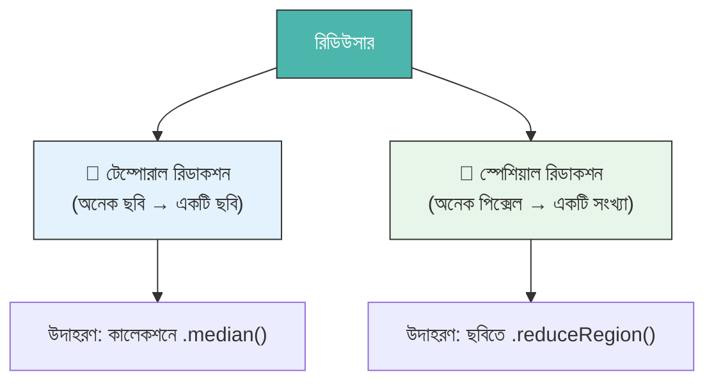
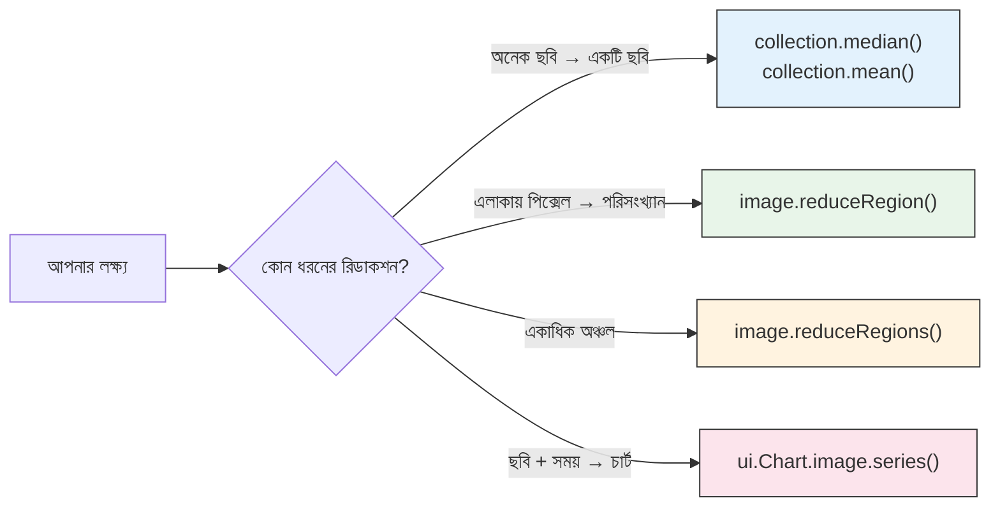

# রিডিউসার — স্থান ও সময়ের মধ্যে ডেটা সংক্ষেপণ (Reducers — Summarizing Data)

একটি **রিডিউসার (Reducer)** হলো একটি গাণিতিক অপারেশন যা অনেকগুলো মানকে একটি সারসংক্ষেপ মানে পরিণত করে।

একটি গ্রেডিং সিস্টেমের কথা ভাবুন। একজন শিক্ষার্থী সারা বছরে ১০টি পরীক্ষায় স্কোর পায়। রিডিউসার তার **গড় স্কোর** বের করে — ১০টি মানকে ১টি অর্থপূর্ণ সংখ্যায় রূপান্তর করে।

আর্থ ইঞ্জিনে, রিডিউসার দুটি মাত্রায় কাজ করে:



---

## অংশ ১: টেম্পোরাল রিডিউসার (কালেকশন → ছবি)

এগুলো একটি **ImageCollection** (সময়ের সাথে অনেক ছবি) কে একটি **একক ছবিতে** রূপান্তর করে।

### সাধারণ টেম্পোরাল রিডিউসার

| রিডিউসার পদ্ধতি | কী ফেরত দেয় | সবচেয়ে ভালো ব্যবহার |
| :--- | :--- | :--- |
| `.median()` | সময়ের মধ্যম মান | মেঘমুক্ত কম্পোজিট |
| `.mean()` | গড় মান | তাপমাত্রা, বৃষ্টিপাত |
| `.min()` | সর্বনিম্ন মান | শুষ্কতম/শীতলতম সময় |
| `.max()` | সর্বোচ্চ মান | বন্যার বিস্তার, আগুন |
| `.sum()` | মোট সঞ্চিত মান | বার্ষিক বৃষ্টিপাতের যোগফল |
| `.mosaic()` | সর্বশেষ পিক্সেল উপরে | দ্রুত ভিজ্যুয়াল কম্পোজিট |

### উদাহরণ: মেঘমুক্ত কম্পোজিট তৈরি

=== "JavaScript"
    ```javascript
    var collection = ee.ImageCollection('LANDSAT/LC08/C02/T1_L2')
      .filterDate('2023-01-01', '2023-12-31')
      .filterBounds(ee.Geometry.Point([85.82, 20.30]));

    // মিডিয়ান স্বাভাবিকভাবেই আউটলায়ার (যেমন মেঘ) সরিয়ে দেয়
    var medianComposite = collection.median();

    // মধ্যমা তাপমাত্রার মতো ক্রমাগত ভ্যারিয়েবলের জন্য ভালো
    var meanImage = collection.mean();

    Map.centerObject(ee.Geometry.Point([85.82, 20.30]), 10);
    Map.addLayer(medianComposite, {bands: ['SR_B4','SR_B3','SR_B2'], min:7000, max:30000}, 'মিডিয়ান কম্পোজিট');
    ```

=== "Python"
    ```python
    collection = ee.ImageCollection('LANDSAT/LC08/C02/T1_L2') \
        .filterDate('2023-01-01', '2023-12-31') \
        .filterBounds(ee.Geometry.Point([85.82, 20.30]))

    median_composite = collection.median()
    mean_image = collection.mean()
    ```

---

## অংশ ২: স্পেশিয়াল রিডিউসার (পিক্সেল → সংখ্যা)

এগুলো একটি ছবির একটি অঞ্চলের **সব পিক্সেল** কে **একটি সারসংক্ষেপ মানে** (বা মানের একটি ডিকশনারিতে) পরিণত করে।

এটি এইসব প্রশ্নের উত্তর দেয়:

- *"আমার অধ্যয়ন এলাকার মধ্যে গড় NDVI মান কত?"*
- *"বন্যা-আক্রান্ত পিক্সেলের মোট আয়তন কত?"*
- *"এই জেলার মধ্যে সর্বোচ্চ উচ্চতা কত?"*

### `.reduceRegion()` — সবচেয়ে শক্তিশালী স্পেশিয়াল রিডিউসার

=== "JavaScript"
    ```javascript
    // একটি অধ্যয়ন এলাকার গড় NDVI গণনা করুন
    var studyArea = ee.Geometry.Rectangle([85.5, 20.1, 86.1, 20.6]);

    var image = ee.ImageCollection('LANDSAT/LC08/C02/T1_L2')
      .filterDate('2023-01-01', '2023-12-31')
      .filterBounds(studyArea)
      .median();

    var ndvi = image.normalizedDifference(['SR_B5', 'SR_B4']).rename('NDVI');

    var stats = ndvi.reduceRegion({
      reducer: ee.Reducer.mean(),  // অপারেশন
      geometry: studyArea,         // কোথায় প্রয়োগ করবেন
      scale: 30,                   // মিটারে পিক্সেল রেজোলিউশন
      maxPixels: 1e9               // নিরাপত্তা সীমা
    });

    print('অধ্যয়ন এলাকায় গড় NDVI:', stats.get('NDVI'));
    ```

=== "Python"
    ```python
    study_area = ee.Geometry.Rectangle([85.5, 20.1, 86.1, 20.6])

    image = ee.ImageCollection('LANDSAT/LC08/C02/T1_L2') \
        .filterDate('2023-01-01', '2023-12-31') \
        .filterBounds(study_area) \
        .median()

    ndvi = image.normalizedDifference(['SR_B5', 'SR_B4']).rename('NDVI')

    stats = ndvi.reduceRegion(
        reducer=ee.Reducer.mean(),
        geometry=study_area,
        scale=30,
        maxPixels=1e9
    )

    print('গড় NDVI:', stats.get('NDVI').getInfo())
    ```

---

## অংশ ৩: একাধিক রিডিউসার একত্রিত করা

আপনি `.combine()` ব্যবহার করে একসাথে একাধিক পরিসংখ্যান গণনা করতে পারেন।

=== "JavaScript"
    ```javascript
    var combinedReducer = ee.Reducer.mean()
      .combine(ee.Reducer.min(), '', true)
      .combine(ee.Reducer.max(), '', true)
      .combine(ee.Reducer.stdDev(), '', true);

    var fullStats = ndvi.reduceRegion({
      reducer: combinedReducer,
      geometry: studyArea,
      scale: 30,
      maxPixels: 1e9
    });

    print('NDVI পরিসংখ্যান:', fullStats);
    // ফেরত দেয়: {NDVI_mean: ..., NDVI_min: ..., NDVI_max: ..., NDVI_stdDev: ...}
    ```

=== "Python"
    ```python
    combined_reducer = ee.Reducer.mean() \
        .combine(ee.Reducer.min(), '', True) \
        .combine(ee.Reducer.max(), '', True) \
        .combine(ee.Reducer.stdDev(), '', True)

    full_stats = ndvi.reduceRegion(
        reducer=combined_reducer,
        geometry=study_area,
        scale=30,
        maxPixels=1e9
    )

    print('NDVI পরিসংখ্যান:', full_stats.getInfo())
    ```

---

## অংশ ৪: ফিচার কালেকশনে রিডাকশন

যখন আপনার কাছে একাধিক অঞ্চল আছে (যেমন, একাধিক জেলা), তখন `.reduceRegions()` ব্যবহার করুন — একসাথে প্রতিটি অঞ্চলের জন্য পরিসংখ্যান গণনা করতে।

=== "JavaScript"
    ```javascript
    // ওডিশার প্রতিটি জেলার NDVI পরিসংখ্যান পান
    var districts = ee.FeatureCollection("FAO/GAUL/2015/level2")
      .filter(ee.Filter.eq('ADM1_NAME', 'Odisha'));

    var withNDVI = ndvi.reduceRegions({
      collection: districts,
      reducer: ee.Reducer.mean(),
      scale: 30
    });

    // প্রতিটি ফিচারে এখন 'mean' NDVI প্রপার্টি আছে
    print('NDVI সহ জেলাগুলো:', withNDVI.first());
    Export.table.toDrive({
      collection: withNDVI,
      description: 'Odisha_District_NDVI',
      fileFormat: 'CSV'
    });
    ```

=== "Python"
    ```python
    districts = ee.FeatureCollection("FAO/GAUL/2015/level2") \
        .filter(ee.Filter.eq('ADM1_NAME', 'Odisha'))

    with_ndvi = ndvi.reduceRegions(
        collection=districts,
        reducer=ee.Reducer.mean(),
        scale=30
    )

    print('প্রথম জেলা NDVI:', with_ndvi.first().getInfo())
    ```

---

## দ্রুত রেফারেন্স চিট শিট



!!! tip "স্কেল গুরুত্বপূর্ণ (Scale Matters)"
    `reduceRegion`-এর `scale` প্যারামিটার গণনার জন্য পিক্সেলের আকার মিটারে নির্ধারণ করে। সবচেয়ে সঠিক ফলাফলের জন্য আপনার ডেটাসেটের **মূল রেজোলিউশন** ব্যবহার করুন (ল্যান্ডস্যাট = ৩০মি, সেন্টিনেল-২ = ১০মি, MODIS = ২৫০মি+)।

!!! warning "সবসময় `maxPixels` সেট করুন"
    `maxPixels` ছাড়া আর্থ ইঞ্জিন বড় গণনা করতে অস্বীকার করবে — আপনাকে রানঅ্যাওয়ে টাস্ক থেকে রক্ষা করতে। বেশিরভাগ ক্ষেত্রে `1e9` (১ বিলিয়ন) সেট করুন।
