# Reducers — Summarizing Data Across Space and Time

A **Reducer** is a mathematical operation that condenses many values into a single summary value.

Think of it like a grading system. A student gets 10 test scores throughout the year. The reducer calculates their **mean score** — compressing 10 values into 1 meaningful number.

In Earth Engine, reducers work across two dimensions:

```mermaid
graph TD
    A[Reducers] --> B["📅 Temporal Reduction\n(Many Images → One Image)"]
    A --> C["📐 Spatial Reduction\n(Many Pixels → One Number)"]
    B --> D["Example: .median() on a collection"]
    C --> E["Example: .reduceRegion() on an image"]
    style A fill:#4db6ac,color:#fff,stroke:#333
    style B fill:#e3f2fd,stroke:#333
    style C fill:#e8f5e9,stroke:#333
```



---

## Part 1: Temporal Reducers (Collection → Image)

These reduce an **ImageCollection** (many images over time) into a **single image**.

### Common Temporal Reducers

| Reducer Method | What it Returns | Best Used For |
| :--- | :--- | :--- |
| `.median()` | Middle value across time | Cloud-free composites |
| `.mean()` | Average value | Temperature, rainfall |
| `.min()` | Lowest value | Driest/coolest period |
| `.max()` | Highest value | Flood extent, fire detection |
| `.sum()` | Total cumulative value | Annual rainfall total |
| `.mosaic()` | Latest pixel on top | Quick visual composite |

### Example: Creating a Cloud-Free Composite

=== "JavaScript"
    ```javascript
    var collection = ee.ImageCollection('LANDSAT/LC08/C02/T1_L2')
      .filterDate('2023-01-01', '2023-12-31')
      .filterBounds(ee.Geometry.Point([85.82, 20.30]));

    // Median removes outliers (e.g., clouds) naturally
    var medianComposite = collection.median();

    // Mean is good for continuous variables like temperature
    var meanImage = collection.mean();

    Map.centerObject(ee.Geometry.Point([85.82, 20.30]), 10);
    Map.addLayer(medianComposite, {bands: ['SR_B4','SR_B3','SR_B2'], min:7000, max:30000}, 'Median Composite');
    ```

=== "Python"
    ```python
    collection = ee.ImageCollection('LANDSAT/LC08/C02/T1_L2') \
        .filterDate('2023-01-01', '2023-12-31') \
        .filterBounds(ee.Geometry.Point([85.82, 20.30]))

    median_composite = collection.median()
    mean_image = collection.mean()
    ```

---

## Part 2: Spatial Reducers (Pixels → Number)

These reduce **all pixels within a region** of an image into a **single summary value** (or a dictionary of values).

This is how you answer questions like:

- *"What is the average NDVI value inside my study area?"*
- *"What is the total area of flood-affected pixels?"*
- *"What is the maximum elevation inside this district?"*

### `.reduceRegion()` — The Most Powerful Spatial Reducer

=== "JavaScript"
    ```javascript
    // Calculate the mean NDVI over a study area
    var studyArea = ee.Geometry.Rectangle([85.5, 20.1, 86.1, 20.6]);

    var image = ee.ImageCollection('LANDSAT/LC08/C02/T1_L2')
      .filterDate('2023-01-01', '2023-12-31')
      .filterBounds(studyArea)
      .median();

    var ndvi = image.normalizedDifference(['SR_B5', 'SR_B4']).rename('NDVI');

    var stats = ndvi.reduceRegion({
      reducer: ee.Reducer.mean(),  // The operation
      geometry: studyArea,         // Where to apply it
      scale: 30,                   // Pixel resolution in meters
      maxPixels: 1e9               // Safety limit
    });

    print('Mean NDVI in study area:', stats.get('NDVI'));
    ```

=== "Python"
    ```python
    study_area = ee.Geometry.Rectangle([85.5, 20.1, 86.1, 20.6])

    image = ee.ImageCollection('LANDSAT/LC08/C02/T1_L2') \
        .filterDate('2023-01-01', '2023-12-31') \
        .filterBounds(study_area) \
        .median()

    ndvi = image.normalizedDifference(['SR_B5', 'SR_B4']).rename('NDVI')

    stats = ndvi.reduceRegion(
        reducer=ee.Reducer.mean(),
        geometry=study_area,
        scale=30,
        maxPixels=1e9
    )

    print('Mean NDVI:', stats.get('NDVI').getInfo())
    ```

---

## Part 3: Combining Multiple Reducers

You can compute multiple statistics simultaneously using `.combine()`.

=== "JavaScript"
    ```javascript
    var combinedReducer = ee.Reducer.mean()
      .combine(ee.Reducer.min(), '', true)
      .combine(ee.Reducer.max(), '', true)
      .combine(ee.Reducer.stdDev(), '', true);

    var fullStats = ndvi.reduceRegion({
      reducer: combinedReducer,
      geometry: studyArea,
      scale: 30,
      maxPixels: 1e9
    });

    print('NDVI Statistics:', fullStats);
    // Returns: {NDVI_mean: ..., NDVI_min: ..., NDVI_max: ..., NDVI_stdDev: ...}
    ```

=== "Python"
    ```python
    combined_reducer = ee.Reducer.mean() \
        .combine(ee.Reducer.min(), '', True) \
        .combine(ee.Reducer.max(), '', True) \
        .combine(ee.Reducer.stdDev(), '', True)

    full_stats = ndvi.reduceRegion(
        reducer=combined_reducer,
        geometry=study_area,
        scale=30,
        maxPixels=1e9
    )

    print('NDVI Statistics:', full_stats.getInfo())
    ```

---

## Part 4: Reducing Over a Feature Collection

When you have multiple regions (e.g., multiple districts), use `.reduceRegions()` to compute stats for each region at once.

=== "JavaScript"
    ```javascript
    // Get NDVI stats for each district in a FeatureCollection
    var districts = ee.FeatureCollection("FAO/GAUL/2015/level2")
      .filter(ee.Filter.eq('ADM1_NAME', 'Odisha'));

    var withNDVI = ndvi.reduceRegions({
      collection: districts,
      reducer: ee.Reducer.mean(),
      scale: 30
    });

    // Each feature now has a 'mean' NDVI property
    print('Districts with NDVI:', withNDVI.first());
    Export.table.toDrive({
      collection: withNDVI,
      description: 'Odisha_District_NDVI',
      fileFormat: 'CSV'
    });
    ```

=== "Python"
    ```python
    districts = ee.FeatureCollection("FAO/GAUL/2015/level2") \
        .filter(ee.Filter.eq('ADM1_NAME', 'Odisha'))

    with_ndvi = ndvi.reduceRegions(
        collection=districts,
        reducer=ee.Reducer.mean(),
        scale=30
    )

    print('First district NDVI:', with_ndvi.first().getInfo())
    ```

---

## Quick Reference Cheat Sheet

```mermaid
graph LR
    A[Your Goal] --> B{What kind of reduction?}
    B -->|Many images → one image| C["collection.median()\ncollection.mean()"]
    B -->|Pixels in area → stats| D["image.reduceRegion()"]
    B -->|Multiple regions| E["image.reduceRegions()"]
    B -->|Images + time → chart| F["ui.Chart.image.series()"]
    style C fill:#e3f2fd,stroke:#333
    style D fill:#e8f5e9,stroke:#333
    style E fill:#fff3e0,stroke:#333
    style F fill:#fce4ec,stroke:#333
```



!!! tip "Scale Matters"
    The `scale` parameter in `reduceRegion` sets the pixel size in metres for the calculation. Use the **native resolution** of your dataset (Landsat = 30m, Sentinel-2 = 10m, MODIS = 250m+) to get the most accurate results.

!!! warning "Always Set `maxPixels`"
    Without `maxPixels`, Earth Engine will refuse to run large computations to protect you from runaway tasks. Set it to `1e9` (1 billion) for most cases.
