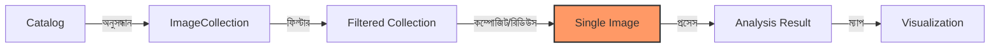

# স্যাটেলাইট ইমেজ নিয়ে কাজ করা (রাস্টার ডেটা)

গুগল আর্থ ইঞ্জিন-এ স্যাটেলাইট ইমেজগুলোকে **রাস্টার ডেটা (Raster Data)** বলা হয়। এগুলোকে পৃথিবীর ডিজিটাল ছবি হিসেবে চিন্তা করতে পারেন।

এই ছবিগুলোর প্রতিটি পিক্সেল তথ্য ধারণ করে। শুধু রঙ (লাল, সবুজ, নীল) নয়, এতে এমন অনেক তথ্য থাকে যা আমাদের চোখ দেখতে পায় না, যেমন- তাপমাত্রা বা গাছের স্বাস্থ্য।

## জনপ্রিয় ডেটাসেটগুলোর ব্যাখ্যা

এখানে সবচেয়ে সাধারণ কিছু "ক্যামেরা" (স্যাটেলাইট) দেওয়া হলো যা আপনি ব্যবহার করবেন:

| স্যাটেলাইট | ব্যবহারের ক্ষেত্র... | বিস্তারিত লেভেল | কত ঘনঘন? |
| :--- | :--- | :--- | :--- |
| **Sentinel-2** | কৃষি, গাছপালা, বিস্তারিত কাজ | উচ্চ (১০ মিটার) | প্রতি ৫ দিনে |
| **Landsat 8 & 9** | দীর্ঘমেয়াদী পরিবর্তন (২০১৩ থেকে) | মাঝারি (৩০ মিটার) | প্রতি ১৬ দিনে |
| **MODIS** | দৈনিক পর্যবেক্ষণ, জলবায়ু, আগুন | নিম্ন (২৫০মি - ১কিমি) | প্রতিদিন |
| **Sentinel-1** | বন্যা, ভূমিধস (রাডার) | মাঝারি (১০ মিটার) | প্রতি ৬-১২ দিনে |

---

## রাস্টার ওয়ার্কফ্লো (The Raster Workflow)



## কীভাবে ডেটাসেট লোড করবেন

এই ইমেজগুলো ব্যবহার করতে হলে ক্যাটালগ থেকে সেগুলোকে "কল" বা ডাকতে হয়।

### ১. ল্যান্ডস্যাট ৮ (Landsat 8) লোড করা

সময়ের সাথে জমিতে কী পরিবর্তন আসছে তা দেখার জন্য এটি সেরা।

=== "JavaScript"
    ```javascript
    // ল্যান্ডস্যাট ৮ কালেকশন লোড করুন
    var landsat = ee.ImageCollection('LANDSAT/LC08/C02/T1_L2')
      .filterDate('2023-01-01', '2023-12-31')
      .filterBounds(ee.Geometry.Point([-122.4, 37.8])); // San Francisco

    print('Number of images:', landsat.size());
    ```

=== "Python"
    ```python
    # ল্যান্ডস্যাট ৮ কালেকশন লোড করুন
    landsat = ee.ImageCollection('LANDSAT/LC08/C02/T1_L2') \
        .filterDate('2023-01-01', '2023-12-31') \
        .filterBounds(ee.Geometry.Point([-122.4, 37.8])) # San Francisco

    print('Number of images:', landsat.size().getInfo())
    ```

### ২. সেন্টিনেল-২ (Sentinel-2) লোড করা

শহর বা ফসলের মাঠের তীক্ষ্ণ ও বিস্তারিত ছবির জন্য এটি সবচেয়ে ভালো।

=== "JavaScript"
    ```javascript
    // সেন্টিনেল-২ লোড করুন
    var sentinel2 = ee.ImageCollection('COPERNICUS/S2_SR_HARMONIZED')
      .filterDate('2023-06-01', '2023-06-30')
      .filterBounds(ee.Geometry.Point([-0.12, 51.50])); // London

    // সবচেয়ে পরিষ্কার ছবি পেতে মেঘের পরিমাণ অনুসারে সাজান
    var clearImage = sentinel2.sort('CLOUDY_PIXEL_PERCENTAGE').first();
    
    // ম্যাপে দেখান
    Map.centerObject(clearImage, 11);
    Map.addLayer(clearImage, {min: 0, max: 3000, bands: ['B4', 'B3', 'B2']}, 'Sentinel-2 RGB');
    ```

=== "Python"
    ```python
    # সেন্টিনেল-২ লোড করুন
    sentinel2 = ee.ImageCollection('COPERNICUS/S2_SR_HARMONIZED') \
        .filterDate('2023-06-01', '2023-06-30') \
        .filterBounds(ee.Geometry.Point([-0.12, 51.50])) # London

    # সবচেয়ে পরিষ্কার ছবি পেতে মেঘের পরিমাণ অনুসারে সাজান
    clear_image = sentinel2.sort('CLOUDY_PIXEL_PERCENTAGE').first()
    
    # ম্যাপে দেখান (geemap ব্যবহার করে)
    Map = geemap.Map()
    Map.centerObject(clear_image, 11)
    Map.addLayer(clear_image, {'min': 0, 'max': 3000, 'bands': ['B4', 'B3', 'B2']}, 'Sentinel-2 RGB')
    Map
    ```

### ৩. জলবায়ু ডেটা লোড করা (ERA5)

তাপমাত্রা বা বৃষ্টিপাত জানতে চান? ERA5 ব্যবহার করুন।

=== "JavaScript"
    ```javascript
    // ERA5 মাসিক ডেটা লোড করুন
    var climate = ee.ImageCollection('ECMWF/ERA5_LAND/MONTHLY_AGGR')
      .filterDate('2023-01-01', '2023-12-31');

    // তাপমাত্রা ব্যান্ডটি নির্বাচন করুন (Kelvin এককে)
    var temp = climate.select('temperature_2m');
    
    // সেলসিয়াসে রূপান্তর করুন এবং গড় নির্ণয় করুন
    var tempC = temp.mean().subtract(273.15);
    
    Map.addLayer(tempC, {min: -10, max: 35, palette: ['blue', 'white', 'red']}, 'Avg Temp (C)');
    ```

=== "Python"
    ```python
    # ERA5 মাসিক ডেটা লোড করুন
    climate = ee.ImageCollection('ECMWF/ERA5_LAND/MONTHLY_AGGR') \
        .filterDate('2023-01-01', '2023-12-31')

    # তাপমাত্রা ব্যান্ডটি নির্বাচন করুন (Kelvin এককে)
    temp = climate.select('temperature_2m')
    
    # সেলসিয়াসে রূপান্তর করুন এবং গড় নির্ণয় করুন
    temp_c = temp.mean().subtract(273.15)
    
    Map = geemap.Map()
    Map.addLayer(temp_c, {'min': -10, 'max': 35, 'palette': ['blue', 'white', 'red']}, 'Avg Temp (C)')
    Map
    ```

---

## পরবর্তী ধাপগুলো কী?

এখন আপনি জানেন কীভাবে এই "রাস্টার" ইমেজগুলো লোড করতে হয়। এরপর শিখুন কীভাবে সেগুলো বিশ্লেষণ করতে হয়!

- [একক ব্যান্ড ইমেজ (Single Band Images)](1 .Working with Single Band Images.md) - কেবল একটি লেয়ার (যেমন- তাপমাত্রা) নিয়ে কাজ করা
- [মাল্টি ব্যান্ড ইমেজ (Multi Band Images)](2. Working with Multi Band Images.md) - অনেকগুলো লেয়ারকে যুক্ত করা (যেমন- লাল+সবুজ+নীল)
- [সূচক গণনা (Calculating Indices)](3. Computing NDVI.md) - গাছপালার জন্য NDVI-এর মতো বিশেষ সূত্র ব্যবহার করা
