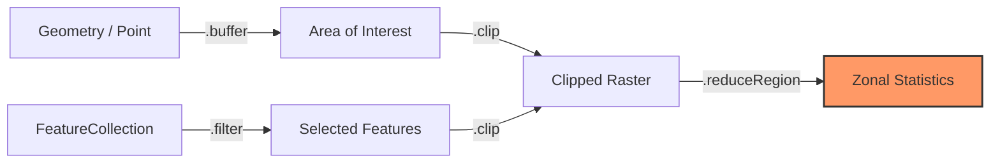

# ম্যাপ বা ভেক্টর ডেটা নিয়ে কাজ করা (Working with Vector Data)

গুগল আর্থ ইঞ্জিন-এ ভেক্টর ডেটাকে বলা হয় **জিওমেট্রি (Geometry)** (বিন্দু, রেখা) বা **ফিচার (Features)** (তথ্য সম্বলিত আকৃতি)। এগুলোকে স্যাটেলাইট ছবির ওপর এঁকে দেওয়া আকৃতি হিসেবে ভাবতে পারেন।

## ভেক্টর ডেটার প্রকারভেদ

| ধরণ | বর্ণনা | উদাহরণ |
| :--- | :--- | :--- |
| **পয়েন্ট (Point)** | একটি নির্দিষ্ট অবস্থান | একটি শহরের স্থানাঙ্ক |
| **লাইনস্ট্রিং (LineString)** | বিন্দুগুলোকে সংযুক্ত করা রেখা | একটি নদী বা রাস্তা |
| **পলিগন (Polygon)** | একটি বদ্ধ আকৃতি | একটি দেশের সীমানা, একটি কৃষিক্ষেত্র |
| **ফিচার কালেকশন (FeatureCollection)** | অনেকগুলো ফিচারের একটি গ্রুপ | বিশ্বের সমস্ত দেশ |

---

## জনপ্রিয় ডেটাসেটসমূহ

আপনাকে সবসময় নিজে আকৃতি আঁকতে হবে না। GEE-তে অনেকগুলো রেডিমেড ভেক্টর ডেটাসেট আছে:

| ডেটাসেট | এটি কী? | কেন ব্যবহার করবেন? |
| :--- | :--- | :--- |
| **LSIB (USDOS)** | বিস্তারিত দেশের সীমানা | দেশের সীমানায় ইমেজ ক্লিপ করতে |
| **FAO GAUL** | প্রশাসনিক সীমানা (রাজ্য/প্রদেশ) | কোনো দেশের নির্দিষ্ট অঞ্চল বিশ্লেষণ করতে |
| **Protected Areas** | জাতীয় উদ্যান ও সংরক্ষিত এলাকা | সংরক্ষণ এলাকা নিয়ে গবেষণা করতে |
| **আপনার নিজের ডেটা** | আপনি যে শেপ আপলোড করেন | আপনার নিজস্ব গবেষণার এলাকা বিশ্লেষণ করতে |

---

## ভেক্টর ওয়ার্কফ্লো (The Vector Workflow)



## ভেক্টর ডেটা কীভাবে লোড করবেন

### ১. বিশ্বের দেশগুলো ফিল্টার করা

=== "JavaScript"
    ```javascript
    // বিশ্বের সীমানা লোড করুন
    var countries = ee.FeatureCollection('USDOS/LSIB_SIMPLE/2017');

    // শুধু ব্রাজিল ফিল্টার করুন
    var brazil = countries.filter(ee.Filter.eq('country_na', 'Brazil'));
    
    Map.centerObject(brazil, 4);
    Map.addLayer(brazil, {color: 'green'}, 'Brazil');
    ```

=== "Python"
    ```python
    # বিশ্বের সীমানা লোড করুন
    countries = ee.FeatureCollection('USDOS/LSIB_SIMPLE/2017')

    # শুধু ব্রাজিল ফিল্টার করুন
    brazil = countries.filter(ee.Filter.eq('country_na', 'Brazil'))
    
    Map = geemap.Map()
    Map.centerObject(brazil, 4)
    Map.addLayer(brazil, {'color': 'green'}, 'Brazil')
    Map
    ```

### ২. নিজের আকৃতি আঁকা

আপনি কোড এডিটরে ম্যাপের ওপর সরাসরি একটি আয়তক্ষেত্র আঁকতে পারেন, অথবা কোডে সেটি ডিফাইন করতে পারেন:

=== "JavaScript"
    ```javascript
    // আমাজন রেইনফরেস্ট অঞ্চলের জন্য একটি আয়তক্ষেত্র ডিফাইন করুন
    var amazon = ee.Geometry.Rectangle([-70.0, -10.0, -50.0, 0.0]);

    Map.addLayer(amazon, {color: 'blue'}, 'Amazon Region');
    ```

=== "Python"
    ```python
    # আমাজন রেইনফরেস্ট অঞ্চলের জন্য একটি আয়তক্ষেত্র ডিফাইন করুন
    amazon = ee.Geometry.Rectangle([-70.0, -10.0, -50.0, 0.0])

    Map = geemap.Map()
    Map.addLayer(amazon, {'color': 'blue'}, 'Amazon Region')
    Map
    ```

---

## এরপর কী করবেন?

- [ফিচার বোঝা](1. Overview of Features.bn.md) - ভেক্টর ডেটার বিস্তারিত জানুন
- [কালেকশন নিয়ে কাজ](2. Feature Collections.bn.md) - ফিচারগুলো ফিল্টার ও বিশ্লেষণ করুন
- [ডেটা এক্সপোর্ট](3. Exporting Vectors.bn.md) - আপনার ফলাফল সেভ করুন
