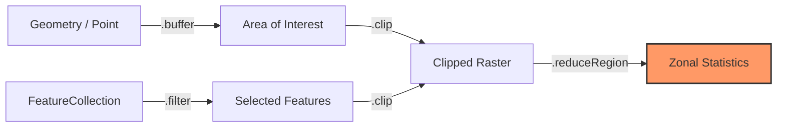

# Working with Maps (Vector Data)

In Google Earth Engine, vector data is called **Geometry** (points, lines) or **Features** (shapes with information). Think of these as drawings on top of the satellite images.

## Types of Vector Data

| Type | Description | Example |
| :--- | :--- | :--- |
| **Point** | A single location | A city coordinate |
| **LineString** | A line connecting points | A river or road |
| **Polygon** | A closed shape | A country border, a field |
| **FeatureCollection** | A group of features | All countries in the world |

---

## Popular Datasets Explained

You don't always have to draw your own shapes. GEE has many ready-to-use vector datasets:

| Dataset | What is it? | Why use it? |
| :--- | :--- | :--- |
| **LSIB (USDOS)** | Detailed Country Boundaries | To clip images to country borders |
| **FAO GAUL** | Admin Boundaries (States/Provinces) | To analyze specific regions within a country |
| **Protected Areas** | National Parks & Reserves | To study conservation areas |
| **Your Own Data** | Shapes you upload | To analyze your specific study area |

---

## The Vector Workflow



## How to Load Vector Data

### 1. Filtering World Countries

=== "JavaScript"
    ```javascript
    // Load the world boundaries
    var countries = ee.FeatureCollection('USDOS/LSIB_SIMPLE/2017');

    // Filter to get only Brazil
    var brazil = countries.filter(ee.Filter.eq('country_na', 'Brazil'));
    
    Map.centerObject(brazil, 4);
    Map.addLayer(brazil, {color: 'green'}, 'Brazil');
    ```

=== "Python"
    ```python
    # Load the world boundaries
    countries = ee.FeatureCollection('USDOS/LSIB_SIMPLE/2017')

    # Filter to get only Brazil
    brazil = countries.filter(ee.Filter.eq('country_na', 'Brazil'))
    
    Map = geemap.Map()
    Map.centerObject(brazil, 4)
    Map.addLayer(brazil, {'color': 'green'}, 'Brazil')
    Map
    ```

### 2. Drawing Your Own Shape

You can draw a rectangle directly on the map in the Code Editor, or define it in code:

=== "JavaScript"
    ```javascript
    // Define a rectangle for the Amazon Rainforest region
    var amazon = ee.Geometry.Rectangle([-70.0, -10.0, -50.0, 0.0]);

    Map.addLayer(amazon, {color: 'blue'}, 'Amazon Region');
    ```

=== "Python"
    ```python
    # Define a rectangle for the Amazon Rainforest region
    amazon = ee.Geometry.Rectangle([-70.0, -10.0, -50.0, 0.0])

    Map = geemap.Map()
    Map.addLayer(amazon, {'color': 'blue'}, 'Amazon Region')
    Map
    ```

---

## What Next?

- [Understand Features](1. Overview of Feature and Feature Collections.md) - Learn the details of vector data
- [Work with Collections](2. Working with Feature Collection.md) - Filter and analyze groups of features
- [Export Data](3. Export Feature Collection.md) - Save your results
