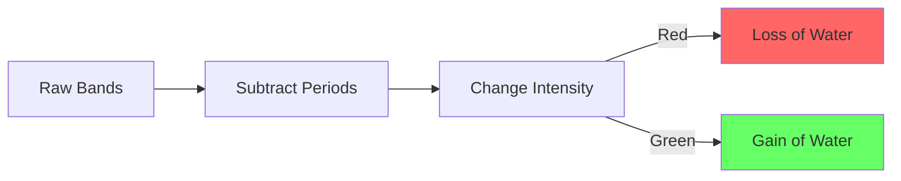

# Exploring the Global Surface Water (GSW) Dataset

The Global Surface Water (GSW) dataset, created by the European Commission's Joint Research Centre (JRC), contains maps of the location and temporal distribution of surface water over 35 years.

---

## 🛰️ 1. Loading the Dataset

The GSW dataset is available in Earth Engine as a single multi-band image.

```javascript
// Import the Global Surface Water dataset
var gsw = ee.Image('JRC/GSW1_4/GlobalSurfaceWater');

// Print metadata to the console
print('GSW Metadata:', gsw);

// Set map center over a region (e.g., Pune, India)
Map.setCenter(73.85, 18.52, 11);
```

---

## 💧 2. Visualizing Occurrence

The `occurrence` band shows the frequency with which water was present on the surface.

```javascript
// Define visualization for water occurrence (0-100%)
var occVis = {
  min: 0.0,
  max: 100.0,
  palette: ['ffffff', 'ffbbbb', '0000ff']
};

// Add the occurrence layer
Map.addLayer(gsw.select('occurrence'), occVis, 'Water Occurrence');
```

---

## 🛡️ 3. Creating a Permanent Water Mask

To identify "permanent" water bodies, we can filter for pixels that have water more than 90% of the time.

```javascript
// Select the occurrence band
var occurrence = gsw.select('occurrence');

// Create a mask for pixels with >90% water occurrence
var permanentWater = occurrence.gt(90).unmask(0);

Map.addLayer(permanentWater, {palette: ['white', 'darkblue']}, 'Permanent Water (>90% Occ)');
```

---

## 📈 4. Analyzing Absolute Change

The `change_abs` band shows the absolute change in water occurrence between two periods (1984-1999 and 2000-2021).



```javascript
var change = gsw.select("change_abs");
var changeVis = {
  min: -50,
  max: 50,
  palette: ['red', 'black', 'limegreen']
};

// Center over a reservoir (Tehri Reservoir)
Map.setCenter(78.48, 30.38, 12);
Map.addLayer(change, changeVis, 'Occurrence Change Intensity');
```

---

## 🔀 5. Surface Water Transitions

This band detects transitions between states (e.g., permanent to seasonal, seasonal to lost).

```javascript
var transition = gsw.select('transition');
var transVis = {
  min: 0,
  max: 10,
  palette: [
    "ffffff", // No water
    "0000ff", // Permanent
    "22b14c", // New permanent
    "d1102d", // Lost permanent
    "99d9ea", // Seasonal
    "b5e61d", // New seasonal
    "e6a1aa", // Lost seasonal
    "ff7f27", // Seasonal to permanent
    "ffc90e", // Permanent to seasonal
    "7f7f7f", // Ephemeral
    "c3c3c3"  // Other
  ]
};

Map.addLayer(transition, transVis, 'Water Transitions');
```

---

## 📚 Summary Table of GSW Bands

| Band Name | Description | Values |
| :--- | :--- | :--- |
| `occurrence` | Water presence frequency | 0 - 100 (%) |
| `change_abs` | Change in occurrence intensity | -100 to 100 |
| `seasonality` | Number of months water is present | 0 - 12 |
| `max_extent` | Any pixel ever detected as water | 0 (no) or 1 (yes) |
| `transition` | Changes in water class types | Categorical (0-10) |

---

> Data Source: [JRC Global Surface Water](https://global-surface-water.appspot.com/)
