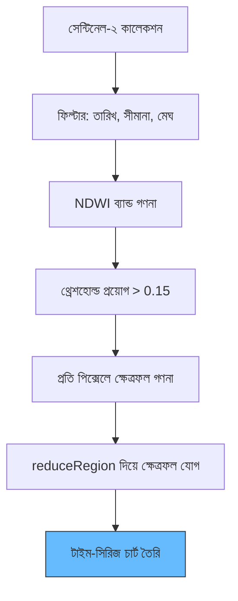

# পানি পৃষ্ঠ ক্ষেত্রফল চার্টিং

সেন্টিনেল-২ স্যাটেলাইট ইমেজারি এবং NDWI (Normalized Difference Water Index) ব্যবহার করে সময়ের সাথে জলাশয়ের মোট পৃষ্ঠ ক্ষেত্রফল গণনা শিখুন।

---

## 🛠️ বিশ্লেষণ কর্মপ্রবাহ



---

## 🛰️ ১. সেটআপ ও ফিল্টারিং

```javascript
var studyArea = ee.Geometry.Polygon([
  [[85.76, 20.52], [85.76, 20.41], [85.95, 20.41], [85.95, 20.52]]
]);

var S2 = ee.ImageCollection("COPERNICUS/S2_SR");
var filtered = S2.filterDate('2020-10-01', '2021-06-01')
                 .filterBounds(studyArea)
                 .filter(ee.Filter.lt('CLOUDY_PIXEL_PERCENTAGE', 30));
Map.centerObject(studyArea, 12);
```

---

## 💧 ২. NDWI গণনা

NDWI গ্রিন (`B3`) ও NIR (`B8`) ব্যান্ড ব্যবহার করে গণনা করা হয়।

```javascript
var addNDWI = function(image) {
  var ndwi = image.normalizedDifference(['B3', 'B8']).rename('ndwi');
  return image.addBands(ndwi);
};
var withNDWI = filtered.map(addNDWI);
```

---

## 📏 ৩. পানির ক্ষেত্রফল গণনা (km²)

```javascript
var ndwiThreshold = 0.15;

var calculateArea = function(image) {
  var waterMask = image.select('ndwi').gte(ndwiThreshold);
  var pixelArea = ee.Image.pixelArea();
  var waterPixels = pixelArea.updateMask(waterMask);
  var stats = waterPixels.reduceRegion({
    reducer: ee.Reducer.sum(), geometry: studyArea,
    scale: 10, maxPixels: 1e8, bestEffort: true
  });
  var areaKm2 = ee.Number(stats.get('area')).divide(1e6);
  return image.set('waterspreadarea', areaKm2);
};
var areaSeries = withNDWI.map(calculateArea);
```

---

## 📊 ৪. ফলাফল ভিজ্যুয়ালাইজেশন

```javascript
var chart = ui.Chart.image.series({
  imageCollection: areaSeries, region: studyArea,
  reducer: ee.Reducer.mean(), scale: 10, xProperty: 'system:time_start'
}).setOptions({
  title: 'পানি বিস্তার ক্ষেত্রফল প্রবণতা',
  hAxis: {title: 'তারিখ'}, vAxis: {title: 'ক্ষেত্রফল (বর্গ কিমি)'}
});
print(chart);
```

---

## 💡 পরামর্শ

1. **ক্লাউড মাস্ক**: বর্ষা মৌসুমে ভালো নির্ভুলতার জন্য স্বয়ংক্রিয় ক্লাউড মাস্কিং ফাংশন প্রয়োগ করুন।
2. **থ্রেশহোল্ডিং**: `0.15` একটি শুরুর পয়েন্ট। আপনার নির্দিষ্ট অঞ্চলের পানির ঘোলাটে ও গভীরতার উপর ভিত্তি করে সামঞ্জস্য করুন।

---
