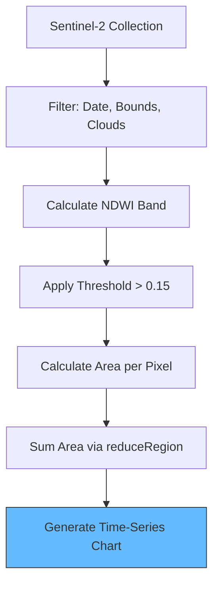

# Water Surface Area Charting

Learn how to calculate the total surface area of water bodies over time using Sentinel-2 satellite imagery and NDWI (Normalized Difference Water Index).

---

## 🛠️ The Analysis Workflow



---

## 🛰️ 1. Setup and Filtering

We start by loading the Sentinel-2 collection and filtering for a specific study area and time range.

```javascript
// Define Study Area (Polygon)
var studyArea = ee.Geometry.Polygon([
  [[85.76, 20.52], [85.76, 20.41], [85.95, 20.41], [85.95, 20.52]]
]);

// Load Sentinel-2 Collection
var S2 = ee.ImageCollection("COPERNICUS/S2_SR");

// Filter for 2020-2021, Study Area, and <30% Clouds
var filtered = S2.filterDate('2020-10-01', '2021-06-01')
                 .filterBounds(studyArea)
                 .filter(ee.Filter.lt('CLOUDY_PIXEL_PERCENTAGE', 30));

Map.centerObject(studyArea, 12);
```

---

## 💧 2. Calculating NDWI

NDWI is calculated using the Green (`B3`) and NIR (`B8`) bands. It highlights water bodies by exploiting their high reflectance in green and high absorption in NIR.

```javascript
// Function to add NDWI band
var addNDWI = function(image) {
  var ndwi = image.normalizedDifference(['B3', 'B8']).rename('ndwi');
  return image.addBands(ndwi);
};

var withNDWI = filtered.map(addNDWI);
```

---

## 📏 3. Calculating Water Area (km²)

We iterate through the collection, masking out non-water pixels and summing the area of the remaining water pixels.

```javascript
var ndwiThreshold = 0.15;

var calculateArea = function(image) {
  // Create water mask
  var waterMask = image.select('ndwi').gte(ndwiThreshold);
  
  // Calculate area of each pixel in sq. meters
  var pixelArea = ee.Image.pixelArea();
  var waterPixels = pixelArea.updateMask(waterMask);
  
  // Sum pixels in the study area
  var stats = waterPixels.reduceRegion({
    reducer: ee.Reducer.sum(),
    geometry: studyArea,
    scale: 10,
    maxPixels: 1e8,
    bestEffort: true
  });
  
  // Convert to km² and add as a property
  var areaKm2 = ee.Number(stats.get('area')).divide(1e6);
  return image.set('waterspreadarea', areaKm2);
};

var areaSeries = withNDWI.map(calculateArea);
```

---

## 📊 4. Visualizing the Results

Finally, we print a chart showing the water area fluctuation over time.

```javascript
var chart = ui.Chart.image.series({
  imageCollection: areaSeries,
  region: studyArea,
  reducer: ee.Reducer.mean(),
  scale: 10,
  xProperty: 'system:time_start'
})
.setSeriesNames(['Area (km²)'])
.setOptions({
  title: 'Water Spread Area Trend',
  hAxis: {title: 'Date'},
  vAxis: {title: 'Area (sq. km)'},
  lineWidth: 2,
  pointSize: 4,
  series: {0: {color: 'blue'}}
});

print(chart);
```

---

## 💡 Pro Tips

1. **Cloud Masks**: For better accuracy during monsoon seasons, implement an automated cloud masking function (using the `QA60` band).
2. **Thresholding**: The threshold `0.15` is a starting point. Adjust it based on the turbidity and depth of the water in your specific region.
3. **Visualization**: Always add a layer to the map to visually verify that your `waterMask` is correctly capturing the water bodies.

---

[View Code in GEE Editor](https://code.earthengine.google.co.in/9e82406b1579173e08c89a7996133dba){ .md-button .md-button--primary }
