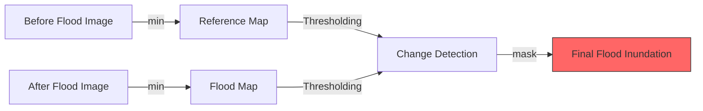

# Flood Mapping with Sentinel-1 Radar

Radar data (SAR) from Sentinel-1 is the primary tool for flood mapping because it can "see" through clouds and works even at night.

---

## 🛰️ Why use Sentinel-1?

| Feature | Advantage for Floods |
| :--- | :--- |
| **Active Sensor** | Operates at night |
| **C-Band Radar** | Penetrates clouds and smoke |
| **Backscatter** | Water reflects radar away (looks black) |
| **High Frequency** | 6-12 day revisit time |

---

## 🛠️ The Flood Detection Workflow



---

## 💻 Code Implementation

We compare radar backscatter between a "dry" date and a "wet" date.

```javascript
// 1. Define Dates
var preFloodDate = ee.Date('2023-05-15');
var postFloodDate = ee.Date('2023-07-09');

// 2. Select polarization (VV is best for water)
var polarization = 'VV';

// 3. Load Images
var preFlood = ee.ImageCollection('COPERNICUS/S1_GRD')
    .filterDate(preFloodDate, preFloodDate.advance(1, 'week'))
    .filter(ee.Filter.listContains('transmitterReceiverPolarisation', polarization))
    .filter(ee.Filter.eq('instrumentMode', 'IW'))
    .select(polarization)
    .min();

var postFlood = ee.ImageCollection('COPERNICUS/S1_GRD')
    .filterDate(postFloodDate, postFloodDate.advance(1, 'week'))
    .filter(ee.Filter.listContains('transmitterReceiverPolarisation', polarization))
    .filter(ee.Filter.eq('instrumentMode', 'IW'))
    .select(polarization)
    .min();

// 4. Remove permanent water to find NEW floods
var permanentWater = ee.ImageCollection('GLCF/GLS_WATER')
    .select('water')
    .mean()
    .neq(2);

var preFloodMasked = preFlood.updateMask(permanentWater);
var postFloodMasked = postFlood.updateMask(permanentWater);

// 5. Visualize
Map.centerObject(ee.Geometry.Point([77.2, 28.7]), 12); // Delhi Region

Map.addLayer(preFloodMasked, {min: -25, max: -5}, 'Pre-Flood (Dry)');
Map.addLayer(postFloodMasked, {min: -25, max: -5}, 'Post-Flood (Wet)');

// 6. Simple Threshold Change Detection
var flooded = postFloodMasked.lt(-18).and(preFloodMasked.gt(-18));
Map.addLayer(flooded.selfMask(), {palette: ['red']}, 'Potential Flood Area');
```

---

## 📉 Interpreting Radar Backscatter

In radar imagery, smooth surfaces (like calm water) act like a mirror, reflecting signals away from the satellite. This results in **very low backscatter (dark pixels)**. When a dry field becomes flooded, its backscatter value drops significantly (e.g., from -10dB to -20dB).

---

## ⚠️ Important Considerations

1. **Urban Floods**: Radar often struggles in cities due to "double-bounce" reflections off buildings.
2. **Wind/Waves**: Rough water surfaces can look "bright" on radar, potentially hiding floods.
3. **Vegetation**: Flooded forests can actually look brighter due to the interaction between the water and tree trunks.

---
