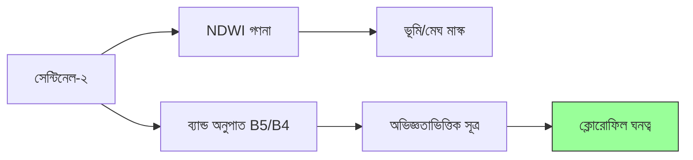

# 🍃 ক্লোরোফিল-a মানচিত্রণ (পানির গুণমান)

সেন্টিনেল-২ মাল্টিস্পেকট্রাল ডেটা ব্যবহার করে ক্লোরোফিল-a ঘনত্ব নির্ণয়ের মাধ্যমে হ্রদের স্বাস্থ্য পর্যবেক্ষণ।

---

## 🔬 বৈজ্ঞানিক ভিত্তি

ক্লোরোফিল-a হলো শৈবাল ও ফাইটোপ্ল্যাংকটনে পাওয়া একটি রঞ্জক। উচ্চ ঘনত্ব প্রায়ই **ইউট্রোফিকেশন** (অতিরিক্ত পুষ্টি) নির্দেশ করে। আমরা **রেড এজ** এবং **রেড** ব্যান্ডে প্রতিফলন পরিমাপ করে এটি অনুমান করতে পারি।



---

## 💻 বাস্তবায়ন

```javascript
// আগ্রহের এলাকা নির্ধারণ
var aoi = ee.Geometry.Point([75.1, 18.2]);

// সেন্টিনেল-২ লোড করুন ও মেঘমুক্ত কম্পোজিট তৈরি করুন
var s2 = ee.ImageCollection('COPERNICUS/S2_HARMONIZED')
                   .filterBounds(aoi)
                   .filterDate('2024-01-01', '2024-01-30')
                   .filter(ee.Filter.lt('CLOUDY_PIXEL_PERCENTAGE', 10))
                   .median();

// শুধু পানি মাস্ক করুন (NDWI > 0)
var ndwi = s2.normalizedDifference(['B3', 'B8']).rename('NDWI');
var s2_water = s2.updateMask(ndwi.gt(0));

// ক্লোরোফিল-a সূত্র
var chla = s2_water.expression(
  '693 * ((B5 - B4) / (B5 + B4)) + 40', {
    'B5': s2_water.select('B5'),  // রেড এজ ১ (705nm)
    'B4': s2_water.select('B4')   // রেড (665nm)
  }).rename('Chlorophyll_a');

Map.centerObject(aoi, 11);
Map.addLayer(chla, {min: 0, max: 25, palette: ['blue','cyan','yellow','green','red']}, 'Chlorophyll-a (mg/m³)');
```

---

## 📊 ফলাফল ব্যাখ্যা

| ঘনত্ব | অবস্থা | নির্দেশক |
| :--- | :--- | :--- |
| **০ - ৫ mg/m³** | অলিগোট্রফিক | উচ্চ পানির স্বচ্ছতা, কম পুষ্টি |
| **৫ - ১০ mg/m³** | মেসোট্রফিক | মাঝারি পুষ্টি, ভালো স্বাস্থ্য |
| **> ১০ mg/m³** | ইউট্রফিক | উচ্চ শৈবালের মাত্রা, সম্ভাব্য কম অক্সিজেন |
| **> ৩০ mg/m³** | হাইপারট্রফিক | গুরুতর দূষণ/শৈবাল ব্লুম |

---

## ⚠️ সীমাবদ্ধতা

1. **অপটিক্যাল গভীরতা**: খুব ঘোলা পানিতে ভাসমান চারু (কাদা) সংকেতে হস্তক্ষেপ করতে পারে।
2. **অ্যালগরিদম টিউনিং**: সহগ (`693` এবং `40`) সাধারণ। উচ্চ-নির্ভুলতা গবেষণার জন্য এগুলো ভূমি-সত্য পানির নমুনা দিয়ে ক্যালিব্রেট করা উচিত।

---
