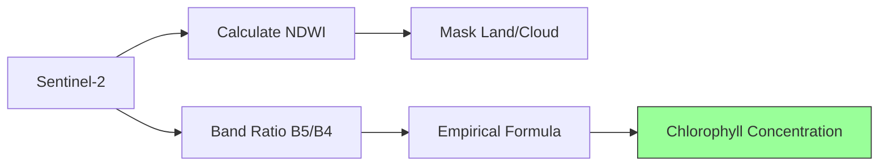

# 🍃 Chlorophyll-a Mapping (Water Quality)

Monitoring lake health by assessing Chlorophyll-a concentration using Sentinel-2 multispectral data.

---

## 🔬 Scientific Basis

Chlorophyll-a is a pigment found in algae and phytoplankton. High concentrations often indicate **eutrophication** (excess nutrients). We can estimate it by measuring the reflectance in the **Red Edge** and **Red** bands.



---

## 💻 Implementation

The following script calculates Chlorophyll-a (mg/m³) for a water body.

```javascript
// 1. Define Area of Interest (Ujani Dam, India)
var aoi = ee.Geometry.Point([75.1, 18.2]);

// 2. Load Sentinel-2 and Create Cloud-free Composite
var s2 = ee.ImageCollection('COPERNICUS/S2_HARMONIZED')
                   .filterBounds(aoi)
                   .filterDate('2024-01-01', '2024-01-30')
                   .filter(ee.Filter.lt('CLOUDY_PIXEL_PERCENTAGE', 10))
                   .median();

// 3. Mask Water only (NDWI > 0)
var ndwi = s2.normalizedDifference(['B3', 'B8']).rename('NDWI');
var s2_water = s2.updateMask(ndwi.gt(0));

// 4. Chlorophyll-a Formula (Gilerson et al., 2010 approximation)
// Index = (B5 - B4) / (B5 + B4)
var chla = s2_water.expression(
  '693 * ((B5 - B4) / (B5 + B4)) + 40', {
    'B5': s2_water.select('B5'),  // Red Edge 1 (705nm)
    'B4': s2_water.select('B4')   // Red (665nm)
  }).rename('Chlorophyll_a');

// 5. Visualize Results
Map.centerObject(aoi, 11);
Map.addLayer(s2.select(['B4','B3','B2']), {min:0, max:3000}, 'Natural Color');
Map.addLayer(chla, {min: 0, max: 25, palette: ['blue','cyan','yellow','green','red']}, 'Chlorophyll-a (mg/m³)');
```

---

## 📊 How to Interpret

| Concentration | Status | Indicator |
| :--- | :--- | :--- |
| **0 - 5 mg/m³** | Oligotrophic | High water clarity, low nutrients |
| **5 - 10 mg/m³** | Mesotrophic | Moderate nutrients, good health |
| **> 10 mg/m³** | Eutrophic | High algae levels, potentially low oxygen |
| **> 30 mg/m³** | Hypertrophic | Severe pollution/algae blooms |

---

## ⚠️ Limitations

1. **Optical Depth**: In very turbid water, suspended sediments (mud) can interfere with the signal.
2. **Algorithm Tuning**: The coefficients (`693` and `40`) are generic. For high-accuracy research, these should be calibrated with ground-truth water samples.

---
