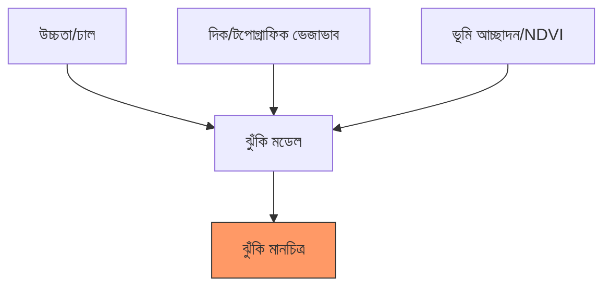

# 🌋 ভূমিধস ঝুঁকি মানচিত্রণ (Landslide Susceptibility Mapping)

ভূমিধস-প্রবণ এলাকা চিহ্নিত করতে ডিজিটাল এলিভেশন মডেল (DEM) এবং মাল্টি-স্পেকট্রাল ডেটা ব্যবহার।

---

## 🏗️ ঝুঁকির কারণসমূহ

ভূমিধস একটি কারণে নয়, বরং একাধিক কারণের সমন্বয়ে ঘটে:



---

## 💻 ১. ভূমিরূপ বিশ্লেষণ (মৌলিক বিষয়)

সবচেয়ে গুরুত্বপূর্ণ কারণ হলো **ঢাল (Slope)**। জমি খাড়া হলে ভূমিধসের সম্ভাবনা বেশি।

```javascript
// ১. SRTM উচ্চতা ডেটা লোড করুন
var srtm = ee.Image("USGS/SRTMGL1_003");

// ২. ঢাল ও দিক গণনা করুন
var slope = ee.Terrain.slope(srtm);
var aspect = ee.Terrain.aspect(srtm);

// ৩. উচ্চ-ঝুঁকি ঢাল নির্বাচন করুন (>৩০ ডিগ্রি)
var highRiskSlope = slope.gt(30);

Map.addLayer(slope, {min: 0, max: 45, palette: ['white', 'red']}, 'Slope Intensity');
Map.addLayer(highRiskSlope.selfMask(), {palette: ['darkred']}, 'High Slope Risk (>30°)');
```

---

## 💻 ২. গাছপালা সংযোজন (NDVI)

গাছপালার শেকড় মাটিকে স্থিতিশীল করে। খাড়া ঢাল এবং কম গাছপালা সহ এলাকা সবচেয়ে বিপজ্জনক।

```javascript
var s2 = ee.ImageCollection("COPERNICUS/S2_SR_HARMONIZED")
  .filterDate('2023-01-01', '2023-12-31').median();

var ndvi = s2.normalizedDifference(['B8', 'B4']).rename('NDVI');

// সম্মিলিত ঝুঁকি: উচ্চ ঢাল এবং কম NDVI
var riskMap = slope.gt(25).and(ndvi.lt(0.3));
Map.addLayer(riskMap.selfMask(), {palette: ['purple']}, 'Combined Landslide Risk');
```

---

## 📊 কারণসমূহের সারসংক্ষেপ

| কারণ | উচ্চ ঝুঁকির শর্ত | কেন? |
| :--- | :--- | :--- |
| **ঢাল** | > ২৫ ডিগ্রি | মাধ্যাকর্ষণ খাড়া ঢালে মাটি নিচে টানে |
| **গাছপালা** | NDVI < ০.২ | শেকড়ের অভাবে মাটি ধরে রাখা যায় না |
| **জলবিদ্যা** | উচ্চ TWI | সম্পৃক্ত মাটি ভারী ও আরও তরল |
| **শিলাবিদ্যা** | ক্ষয়িত শিলা | নরম পদার্থ শক্ত শিলার চেয়ে সহজে পিছলে যায় |

---
