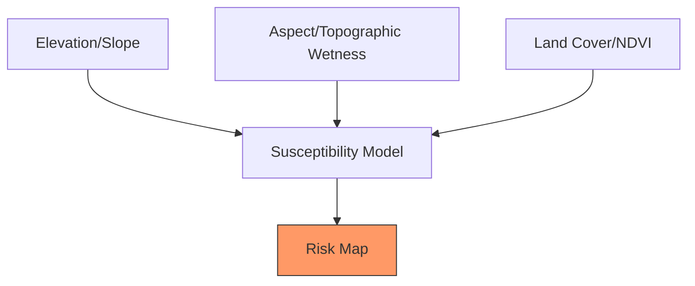

# 🌋 Landslide Susceptibility Mapping

Using Digital Elevation Models (DEM) and multi-spectral data to identify areas prone to landslides.

---

## 🏗️ Factors for Susceptibility

A landslide isn't caused by one thing, but a combination of factors:



---

## 💻 1. Terrain Analysis (The Fundamentals)

The most important factor is **Slope**. If the land is steep, it's more likely to slide.

```javascript
// 1. Load SRTM Elevation Data
var srtm = ee.Image("USGS/SRTMGL1_003");

// 2. Calculate Slope and Aspect
var slope = ee.Terrain.slope(srtm);
var aspect = ee.Terrain.aspect(srtm);

// 3. Select High-Risk Slopes (>30 degrees)
var highRiskSlope = slope.gt(30);

Map.addLayer(slope, {min: 0, max: 45, palette: ['white', 'red']}, 'Slope Intensity');
Map.addLayer(highRiskSlope.selfMask(), {palette: ['darkred']}, 'High Slope Risk (>30°)');
```

---

## 💻 2. Integrating Vegetation (NDVI)

Vegetation roots stabilize the soil. Areas with steep slopes AND low vegetation are the most dangerous.

```javascript
// 4. Load Sentinel-2 for Vegetation
var s2 = ee.ImageCollection("COPERNICUS/S2_SR_HARMONIZED")
  .filterDate('2023-01-01', '2023-12-31')
  .median();

var ndvi = s2.normalizedDifference(['B8', 'B4']).rename('NDVI');

// 5. Combined Risk: High Slope AND Low NDVI
var riskMap = slope.gt(25).and(ndvi.lt(0.3));

Map.addLayer(riskMap.selfMask(), {palette: ['purple']}, 'Combined Landslide Risk');
```

---

## 📊 Summary of Factors

| Factor | High Risk Condition | Why? |
| :--- | :--- | :--- |
| **Slope** | > 25 degrees | Gravity pulls soil down steep inclines |
| **Vegetation** | NDVI < 0.2 | Lack of roots to hold soil together |
| **Hydrology** | High TWI | Saturated soil is heavier and more fluid |
| **Lithology** | Weathered Rock | Soft material slides easier than bedrock |

---
