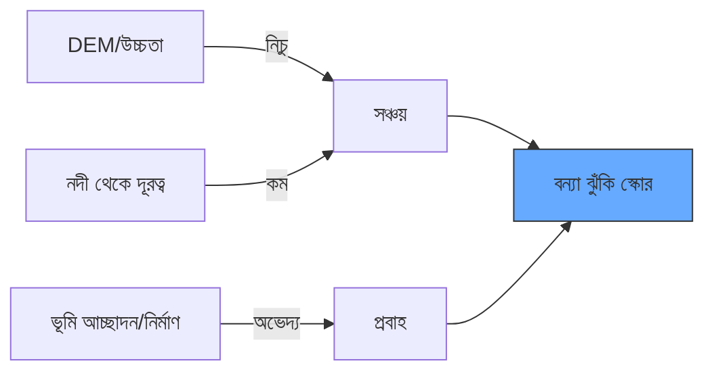

# 🌊 বন্যা ঝুঁকি মানচিত্রণ (Flood Susceptibility Mapping)

ভূগোল ও ঐতিহাসিক ডেটার ভিত্তিতে বন্যা-ঝুঁকিপূর্ণ এলাকা চিহ্নিতকরণ। রিয়েল-টাইম বন্যা মানচিত্রণের বিপরীতে, এটি দীর্ঘমেয়াদী পরিকল্পনায় সাহায্য করে।

---

## 📈 প্রধান ঝুঁকির কারণসমূহ

বন্যার ঝুঁকি নির্ধারিত হয় পানি কোথায় *যেতে চায়* (নিচু উচ্চতা) এবং কোথায় *নিষ্কাশন হতে পারে না* (সম্পৃক্ত মাটি, নগর পৃষ্ঠ) তার উপর ভিত্তি করে।



---

## 💻 ১. নদী থেকে দূরত্ব

নদীর কাছে থাকা সবচেয়ে স্পষ্ট ঝুঁকির কারণ।

```javascript
// নদী ডেটা লোড করুন
var rivers = ee.FeatureCollection("projects/sat-io/open-datasets/GRWL/water_mask_v1_01");

// দূরত্ব বাফার তৈরি করুন (যেমন- ৫০০মি)
var riverBuffer = rivers.distance({searchRadius: 1000, maxError: 50});
Map.addLayer(riverBuffer, {min: 0, max: 1000, palette: ['blue', 'white']}, 'Proximity to Water');
```

---

## 💻 ২. নিকটতম নিষ্কাশন থেকে উচ্চতা (HAND)

শুধু উচ্চতা পরীক্ষা যথেষ্ট নয়—আপনাকে জানতে হবে নিকটতম নদীর তুলনায় আপনি কতটা উঁচু।

```javascript
// Merit Hydro লোড করুন (গ্লোবাল হাইড্রোগ্রাফি)
var hand = ee.Image("MERIT/Hydro/v1_0_1").select('hand');

// নিষ্কাশন থেকে ৫মি এর কম উচ্চতার এলাকা উচ্চ ঝুঁকিপূর্ণ
var floodPlains = hand.lt(5);
Map.addLayer(floodPlains.selfMask(), {palette: ['cyan']}, 'Flood Plain Susceptibility (<5m)');
```

---

## 💻 ৩. অভেদ্য পৃষ্ঠ সংযোজন (নগর)

শহরে বেশি বন্যা হয় কারণ কংক্রিট পানি শোষণ করে না।

```javascript
// গ্লোবাল হিউম্যান সেটলমেন্ট লেয়ার লোড করুন
var ghsl = ee.ImageCollection("JRC/GHSL/P2023A/GHS_BUILT_S").filterDate('2020-01-01').first();

// সম্মিলিত: কম তুলনামূলক উচ্চতা এবং নগর এলাকা
var urbanFloodRisk = hand.lt(5).and(ghsl.gt(20));
Map.addLayer(urbanFloodRisk.selfMask(), {palette: ['red']}, 'Urban Flood Susceptibility');
```

---

## 🗺️ ঝুঁকি ম্যাট্রিক্স

| উচ্চতা (HAND) | ভূমি আচ্ছাদন | ঝুঁকির মাত্রা |
| :--- | :--- | :--- |
| **< ২মি** | যেকোনো | **জটিল** |
| **২মি - ৫মি** | নগর | **উচ্চ** |
| **২মি - ৫মি** | বন | **নিম্ন** |
| **> ১০মি** | যেকোনো | **নগণ্য** |

---
