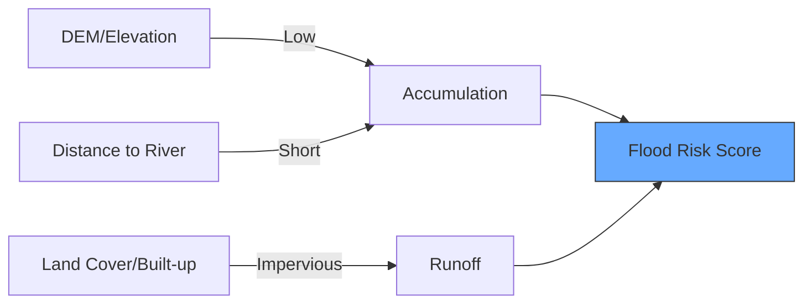

# 🌊 Flood Susceptibility Mapping

Identifying areas at risk of flooding based on geography and historic data. Unlike real-time flood mapping, this helps with long-term planning.

---

## 📈 Key Risk Factors

Flood risk is defined by where water *wants* to go (low elevation) and where it *can't* drain (saturated soil, urban surfaces).



---

## 💻 1. Distance from Rivers

Being close to a river is the most obvious risk factor.

```javascript
// 1. Load River Data (WWF Free-flowing rivers)
var rivers = ee.FeatureCollection("projects/sat-io/open-datasets/GRWL/water_mask_v1_01");

// 2. Create Distance Buffer (e.g., 500m)
var riverBuffer = rivers.distance({searchRadius: 1000, maxError: 50});

Map.addLayer(riverBuffer, {min: 0, max: 1000, palette: ['blue', 'white']}, 'Proximity to Water');
```

---

## 💻 2. Height Above Nearest Drainage (HAND)

A simple elevation check isn't enough—you need to know how high you are relative to the nearest stream.

```javascript
// 3. Load Merit Hydro (Global Hydrography)
// This dataset includes HAND which is a great proxy for flood risk
var hand = ee.Image("MERIT/Hydro/v1_0_1").select('hand');

// 4. Areas less than 5m above drainage are high risk
var floodPlains = hand.lt(5);

Map.addLayer(hand, {min: 0, max: 20}, 'HAND Elevation', false);
Map.addLayer(floodPlains.selfMask(), {palette: ['cyan']}, 'Flood Plain Susceptibility (<5m)');
```

---

## 💻 3. Integrating Impervious Surfaces (Urban)

Cities flood more because concrete doesn't absorb water.

```javascript
// 5. Load Global Human Settlement Layer
var ghsl = ee.ImageCollection("JRC/GHSL/P2023A/GHS_BUILT_S").filterDate('2020-01-01').first();

// 6. Combine: Low relative elevation AND Urban area
var urbanFloodRisk = hand.lt(5).and(ghsl.gt(20));

Map.addLayer(urbanFloodRisk.selfMask(), {palette: ['red']}, 'Urban Flood Susceptibility');
```

---

## 🗺️ Susceptibility Matrix

| Elevation (HAND) | Land Cover | Risk Level |
| :--- | :--- | :--- |
| **< 2m** | Any | **CRITICAL** |
| **2m - 5m** | Urban | **HIGH** |
| **2m - 5m** | Forest | **LOW** |
| **> 10m** | Any | **NEGLIGIBLE** |

---
