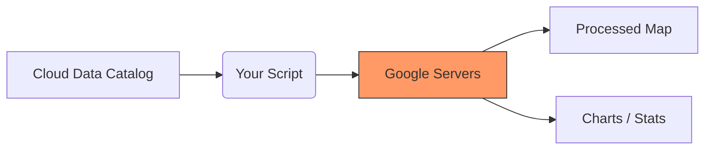

# Quick Start Guide

Welcome! This page will get you started with Google Earth Engine in just a few minutes.

## Choose Your Language

Google Earth Engine works with both **JavaScript** and **Python**. Pick whichever you prefer:

| JavaScript | Python |
| --- | --- |
| ✅ No installation needed | ⚠️ Requires Python installation |
| ✅ Works in web browser | ✅ Works in Jupyter notebooks |
| ✅ Built-in Code Editor | ✅ Use familiar Python tools |
| ✅ Great for beginners | ✅ Great for data scientists |

**All examples on this site show both languages - just click the tabs!**

---

## The GEE Workflow

Before we write code, here is how Earth Engine works conceptually:



## Your First GEE Script

Let's load and display a satellite image. Click the tabs to see the code in your preferred language:

=== "JavaScript"
    ```javascript
    // Load a Landsat 8 image
    var image = ee.Image('LANDSAT/LC08/C02/T1_L2/LC08_044034_20140318');

    // Define how to display it (RGB = Red, Green, Blue bands)
    var visParams = {
      bands: ['SR_B4', 'SR_B3', 'SR_B2'],
      min: 7000,
      max: 12000
    };
    
    // Center the map and add the image
    Map.centerObject(image, 8);
    Map.addLayer(image, visParams, 'Landsat Image');
    
    // Print information about the image
    print('Image details:', image);
    ```

=== "Python"
    ```python
    import ee
    import geemap

    # Initialize Earth Engine
    ee.Initialize()
    
    # Load a Landsat 8 image
    image = ee.Image('LANDSAT/LC08/C02/T1_L2/LC08_044034_20140318')
    
    # Define how to display it (RGB = Red, Green, Blue bands)
    vis_params = {
        'bands': ['SR_B4', 'SR_B3', 'SR_B2'],
        'min': 7000,
        'max': 12000
    }
    
    # Create a map and add the image
    Map = geemap.Map()
    Map.centerObject(image, 8)
    Map.addLayer(image, vis_params, 'Landsat Image')
    
    # Print information about the image
    print('Image details:', image.getInfo())
    
    # Display the map
    Map
    ```


*Above: Example of a Landsat 8 image (Grand Canyon). The code above loads a similar image over California.*

**What this does:**

1. Loads a satellite image from 2014
2. Selects the Red, Green, and Blue bands to create a natural color image
3. Displays it on a map
4. Prints information about the image

---

## Calculate Vegetation Health (NDVI)

NDVI (Normalized Difference Vegetation Index) shows where plants are healthy. Green = healthy vegetation, brown = bare soil.

=== "JavaScript"
    ```javascript
    // Load the image
    var image = ee.Image('LANDSAT/LC08/C02/T1_L2/LC08_044034_20140318');

    // Calculate NDVI (uses Near-Infrared and Red bands)
    var ndvi = image.normalizedDifference(['SR_B5', 'SR_B4'])
      .rename('NDVI');
    
    // Display it with a color palette
    var ndviParams = {
      min: -1,
      max: 1,
      palette: ['blue', 'white', 'green']
    };
    
    Map.centerObject(image, 8);
    Map.addLayer(ndvi, ndviParams, 'NDVI');
    ```

=== "Python"
    ```python
    import ee
    import geemap

    ee.Initialize()
    
    # Load the image
    image = ee.Image('LANDSAT/LC08/C02/T1_L2/LC08_044034_20140318')
    
    # Calculate NDVI (uses Near-Infrared and Red bands)
    ndvi = image.normalizedDifference(['SR_B5', 'SR_B4']) \
        .rename('NDVI')
    
    # Display it with a color palette
    ndvi_params = {
        'min': -1,
        'max': 1,
        'palette': ['blue', 'white', 'green']
    }
    
    Map = geemap.Map()
    Map.centerObject(image, 8)
    Map.addLayer(ndvi, ndvi_params, 'NDVI')
    Map
    ```


*Above: Example of a Global NDVI map. The code above calculates NDVI for a single image.*

**What this does:**

- Calculates vegetation health using infrared and red light
- Blue = water
- White = bare soil or urban areas
- Green = healthy vegetation

---

## Work with Multiple Images

Instead of one image, let's work with many images over time:

=== "JavaScript"
    ```javascript
    // Define your area of interest
    var point = ee.Geometry.Point([-122.4, 37.8]); // San Francisco

    // Load all Landsat 8 images from 2023
    var collection = ee.ImageCollection('LANDSAT/LC08/C02/T1_L2')
      .filterDate('2023-01-01', '2023-12-31')
      .filterBounds(point)
      .filter(ee.Filter.lt('CLOUD_COVER', 20));
    
    // How many images did we find?
    print('Number of images:', collection.size());
    
    // Create a cloud-free composite (median of all images)
    var composite = collection.median();
    
    // Display it
    var visParams = {
      bands: ['SR_B4', 'SR_B3', 'SR_B2'],
      min: 7000,
      max: 12000
    };
    
    Map.centerObject(point, 10);
    Map.addLayer(composite, visParams, '2023 Composite');
    ```

=== "Python"
    ```python
    import ee
    import geemap

    ee.Initialize()
    
    # Define your area of interest
    point = ee.Geometry.Point([-122.4, 37.8])  # San Francisco
    
    # Load all Landsat 8 images from 2023
    collection = ee.ImageCollection('LANDSAT/LC08/C02/T1_L2') \
        .filterDate('2023-01-01', '2023-12-31') \
        .filterBounds(point) \
        .filter(ee.Filter.lt('CLOUD_COVER', 20))
    
    # How many images did we find?
    print('Number of images:', collection.size().getInfo())
    
    # Create a cloud-free composite (median of all images)
    composite = collection.median()
    
    # Display it
    vis_params = {
        'bands': ['SR_B4', 'SR_B3', 'SR_B2'],
        'min': 7000,
        'max': 12000
    }
    
    Map = geemap.Map()
    Map.centerObject(point, 10)
    Map.addLayer(composite, vis_params, '2023 Composite')
    Map
    ```

**What this does:**

1. Finds all Landsat 8 images from 2023 over San Francisco
2. Filters to only images with less than 20% cloud cover
3. Combines them into one cloud-free image (using the median value)
4. Displays the result

---

## Next Steps

Now that you've seen the basics, here's where to go next:

1. **[Set up your account](1. Code Editor/0. Registration.md)** - Create a free GEE account
2. **[Learn the interface](1. Code Editor/1. User Interface of Code Editor.md)** - Understand the Code Editor
3. **[JavaScript vs Python](1. Code Editor/3. Javascipt vs python.md)** - Detailed comparison
4. **[More examples](code_examples.md)** - Comprehensive code reference

---

## Key Takeaways

✅ **Both languages work the same** - Choose JavaScript or Python based on your preference

✅ **No downloads needed for JavaScript** - Everything runs in your browser

✅ **Python offers more flexibility** - Integrate with other Python libraries

✅ **All examples are tabbed** - Easy to compare and learn both

✅ **Start simple, build up** - Begin with single images, then collections, then analysis

---

**Ready to dive deeper? Continue to the full guide!**

[Continue Learning →](README.md){ .md-button .md-button--primary }
