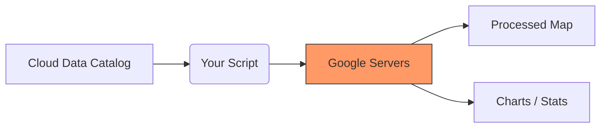

# Home

Welcome! This page will get you started with Google Earth Engine in just a few minutes.

## Choose Your Language

Google Earth Engine works with both **JavaScript** and **Python**. Pick whichever you prefer:

| JavaScript | Python |
| --- | --- |
| ✅ No installation needed | ⚠️ Requires Python installation |
| ✅ Works in web browser | ✅ Works in Jupyter notebooks |
| ✅ Built-in Code Editor | ✅ Use familiar Python tools |
| ✅ Great for beginners | ✅ Great for data scientists |

**All examples on this site show both languages - just click the tabs!**

---

## The GEE Workflow

Before we write code, here is how Earth Engine works conceptually:



## Your First GEE Script

Let's load and display a satellite image. Click the tabs to see the code in your preferred language:

=== "JavaScript"
    ```javascript
    // Define region of interest and filter ImageCollection
    var roi = ee.Geometry.Point([85.895153, 20.461628]);
    var collection = ee.ImageCollection("LANDSAT/LC08/C02/T1_L2")
      .filterDate('2022-01-01', '2022-12-31')
      .filterBounds(roi);

    // Define and map NDVI calculation function
    var calculateNDVI = function(image) {
      var ndvi = image.normalizedDifference(['SR_B5', 'SR_B4']).rename('NDVI');
      return image.addBands(ndvi);
    };
    var ndviCollection = collection.map(calculateNDVI);

    // Calculate mean NDVI over ROI for each image
    var meanNDVI = ndviCollection.map(function(image) {
      var mean = image.select('NDVI').reduceRegion({
        reducer: ee.Reducer.mean(),
        geometry: roi,
        scale: 30
      });
      return image.set('meanNDVI', mean.get('NDVI'));
    });

    // Convert to FeatureCollection and export table to Google Drive
    var ndviTimeSeries = meanNDVI.map(function(image) {
      return ee.Feature(null, {
        'date': image.date().format('YYYY-MM-dd'),
        'meanNDVI': image.get('meanNDVI')
      });
    });
    
    Export.table.toDrive({
      collection: ndviTimeSeries,
      description: 'NDVI_TimeSeries',
      fileFormat: 'CSV'
    });

    // Create a chart of NDVI over time
    var ndviChart = ui.Chart.feature.byFeature({
      features: ndviTimeSeries,
      xProperty: 'date',
      yProperties: ['meanNDVI']
    }).setOptions({
      title: 'Mean NDVI Over Time',
      hAxis: {title: 'Date'},
      vAxis: {title: 'Mean NDVI'},
      lineWidth: 1,
      pointSize: 3,
    });
    print(ndviChart);

    // Create a median NDVI composite for 2022
    var medianNDVI = ndviCollection.select('NDVI').median().clip(roi);

    // Export the NDVI composite image to Google Drive
    Export.image.toDrive({
      image: medianNDVI,
      description: 'Median_NDVI_2022',
      folder: 'EarthEngineExports',
      region: roi.buffer(10000).bounds(), // Exporting 10km area around the point
      scale: 30,
      crs: 'EPSG:4326',
      maxPixels: 1e13
    });
    ```

=== "Python"
    ```python
    import ee
    import geemap

    # Initialize Earth Engine
    ee.Initialize()

    # Define region of interest and filter ImageCollection
    roi = ee.Geometry.Point([85.895153, 20.461628])
    collection = ee.ImageCollection("LANDSAT/LC08/C02/T1_L2") \
      .filterDate('2022-01-01', '2022-12-31') \
      .filterBounds(roi)

    # Define NDVI calculation function
    def calculate_ndvi(image):
        ndvi = image.normalizedDifference(['SR_B5', 'SR_B4']).rename('NDVI')
        return image.addBands(ndvi)

    ndvi_collection = collection.map(calculate_ndvi)

    # Calculate mean NDVI over ROI for each image
    def get_mean_ndvi(image):
        mean = image.select('NDVI').reduceRegion(
            reducer=ee.Reducer.mean(),
            geometry=roi,
            scale=30
        )
        return image.set('meanNDVI', mean.get('NDVI'))

    mean_ndvi_collection = ndvi_collection.map(get_mean_ndvi)

    # Create a median NDVI composite for 2022
    median_ndvi = ndvi_collection.select('NDVI').median()

    # Display results on a map
    Map = geemap.Map()
    Map.centerObject(roi, 12)
    Map.addLayer(median_ndvi, {'min': 0, 'max': 1, 'palette': ['blue', 'white', 'green']}, 'Median NDVI')
    Map
    ```

**What this script does:**

1. **Defines a Point of Interest**: Uses specific coordinates to focus the analysis.
2. **Filters Data**: Searches the massive Landsat 8 catalog for all images from 2022 covering that point.
3. **Calculates NDVI**: Automatically computes vegetation health (NDVI) for every single image in the collection.
4. **Time-Series Analysis**: Calculates the average NDVI for each date to track changes over time.
5. **Charts & Exports**: Generates a time-series chart and prepares a CSV export of the data to your Google Drive.
6. **Composite Image**: Creates a "cloud-free" median composite of NDVI for the entire year and exports the resulting map.

---

## Calculate Vegetation Health (NDVI)

NDVI (Normalized Difference Vegetation Index) shows where plants are healthy. Green = healthy vegetation, brown = bare soil.

=== "JavaScript"
    ```javascript
    // Load the image
    var image = ee.Image('LANDSAT/LC08/C02/T1_L2/LC08_044034_20140318');

    // Calculate NDVI (uses Near-Infrared and Red bands)
    var ndvi = image.normalizedDifference(['SR_B5', 'SR_B4'])
      .rename('NDVI');
    
    // Display it with a color palette
    var ndviParams = {
      min: -1,
      max: 1,
      palette: ['blue', 'white', 'green']
    };
    
    Map.centerObject(image, 8);
    Map.addLayer(ndvi, ndviParams, 'NDVI');
    ```

=== "Python"
    ```python
    import ee
    import geemap

    ee.Initialize()
    
    # Load the image
    image = ee.Image('LANDSAT/LC08/C02/T1_L2/LC08_044034_20140318')
    
    # Calculate NDVI (uses Near-Infrared and Red bands)
    ndvi = image.normalizedDifference(['SR_B5', 'SR_B4']) \
        .rename('NDVI')
    
    # Display it with a color palette
    ndvi_params = {
        'min': -1,
        'max': 1,
        'palette': ['blue', 'white', 'green']
    }
    
    Map = geemap.Map()
    Map.centerObject(image, 8)
    Map.addLayer(ndvi, ndvi_params, 'NDVI')
    Map
    ```


*Above: Example of a Global NDVI map. The code above calculates NDVI for a single image.*

**What this does:**

- Calculates vegetation health using infrared and red light
- Blue = water
- White = bare soil or urban areas
- Green = healthy vegetation

---

## Work with Multiple Images

Instead of one image, let's work with many images over time:

=== "JavaScript"
    ```javascript
    // Define your area of interest
    var point = ee.Geometry.Point([-122.4, 37.8]); // San Francisco

    // Load all Landsat 8 images from 2023
    var collection = ee.ImageCollection('LANDSAT/LC08/C02/T1_L2')
      .filterDate('2023-01-01', '2023-12-31')
      .filterBounds(point)
      .filter(ee.Filter.lt('CLOUD_COVER', 20));
    
    // How many images did we find?
    print('Number of images:', collection.size());
    
    // Create a cloud-free composite (median of all images)
    var composite = collection.median();
    
    // Display it
    var visParams = {
      bands: ['SR_B4', 'SR_B3', 'SR_B2'],
      min: 7000,
      max: 12000
    };
    
    Map.centerObject(point, 10);
    Map.addLayer(composite, visParams, '2023 Composite');
    ```

=== "Python"
    ```python
    import ee
    import geemap

    ee.Initialize()
    
    # Define your area of interest
    point = ee.Geometry.Point([-122.4, 37.8])  # San Francisco
    
    # Load all Landsat 8 images from 2023
    collection = ee.ImageCollection('LANDSAT/LC08/C02/T1_L2') \
        .filterDate('2023-01-01', '2023-12-31') \
        .filterBounds(point) \
        .filter(ee.Filter.lt('CLOUD_COVER', 20))
    
    # How many images did we find?
    print('Number of images:', collection.size().getInfo())
    
    # Create a cloud-free composite (median of all images)
    composite = collection.median()
    
    # Display it
    vis_params = {
        'bands': ['SR_B4', 'SR_B3', 'SR_B2'],
        'min': 7000,
        'max': 12000
    }
    
    Map = geemap.Map()
    Map.centerObject(point, 10)
    Map.addLayer(composite, vis_params, '2023 Composite')
    Map
    ```

**What this does:**

1. Finds all Landsat 8 images from 2023 over San Francisco
2. Filters to only images with less than 20% cloud cover
3. Combines them into one cloud-free image (using the median value)
4. Displays the result

---

## Next Steps

Now that you've seen the basics, here's where to go next:

1. **[Set up your account](gee/1. Code Editor/0. Registration.md)** - Create a free GEE account
2. **[Learn the interface](gee/1. Code Editor/1. User Interface of Code Editor.md)** - Understand the Code Editor
3. **[JavaScript vs Python](gee/1. Code Editor/3. Javascipt vs python.md)** - Detailed comparison
4. **[More examples](gee/code_examples.md)** - Comprehensive code reference

---

## Key Takeaways

✅ **Both languages work the same** - Choose JavaScript or Python based on your preference

✅ **No downloads needed for JavaScript** - Everything runs in your browser

✅ **Python offers more flexibility** - Integrate with other Python libraries

✅ **All examples are tabbed** - Easy to compare and learn both

✅ **Start simple, build up** - Begin with single images, then collections, then analysis

---

**Ready to dive deeper? Continue to the full guide!**

[Continue Learning →](gee/1. Code Editor/0. Registration.md){ .md-button .md-button--primary }
