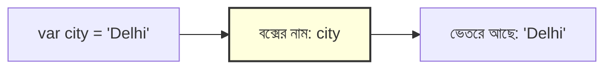
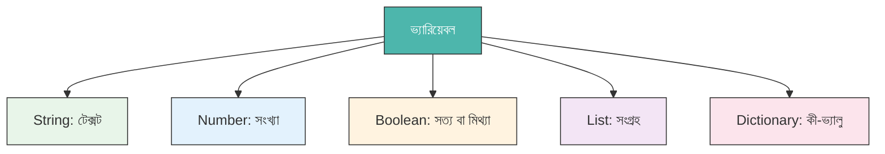

# ভ্যারিয়েবল — প্রোগ্রামিং-এর স্টোরেজ বক্স (Variables — The Storage Boxes of Programming)

একটি **ভ্যারিয়েবল (Variable)** হলো একটি লেবেলযুক্ত স্টোরেজ বক্সের মতো। আপনি তার ভেতরে কিছু রাখেন, বক্সটিকে একটি নাম দেন, এবং যখনই দরকার হয় সেই নাম ব্যবহার করে ভেতরের জিনিসটি নিয়ে আসেন।



---

## ভ্যারিয়েবল ঘোষণা করা (Declaring a Variable)

=== "JavaScript"
    ```javascript
    // 'city' নামে একটি ভ্যারিয়েবল তৈরি করুন এবং 'Delhi' টেক্সটটি সংরক্ষণ করুন
    var city = 'Delhi';

    // 'population' নামে একটি ভ্যারিয়েবল তৈরি করুন এবং একটি সংখ্যা সংরক্ষণ করুন
    var population = 32941000;

    // উভয় ভ্যারিয়েবল কনসোলে প্রিন্ট করুন
    print('শহর:', city);
    print('জনসংখ্যা:', population);
    ```

=== "Python"
    ```python
    # 'city' নামে একটি ভ্যারিয়েবল তৈরি করুন এবং 'Delhi' টেক্সটটি সংরক্ষণ করুন
    city = 'Delhi'

    # 'population' নামে একটি ভ্যারিয়েবল তৈরি করুন এবং একটি সংখ্যা সংরক্ষণ করুন
    population = 32941000

    # উভয় ভ্যারিয়েবল প্রিন্ট করুন
    print('শহর:', city)
    print('জনসংখ্যা:', population)
    ```

---

## ভ্যারিয়েবলের প্রকারভেদ (Types of Variables)

প্রতিটি মানের একটি **টাইপ (Type)** আছে। এটিকে স্টোরেজ বক্সের আকার হিসেবে ভাবুন — এটি নির্ধারণ করে বক্সের ভেতরে কী ধরণের জিনিস রাখা যাবে।

| টাইপ (Type) | উদাহরণ | কী ধারণ করে |
| :--- | :--- | :--- |
| **String (স্ট্রিং)** | `'Hello'` | টেক্সট বা লেখা |
| **Number (নাম্বার)** | `42`, `3.14` | পূর্ণসংখ্যা ও দশমিক |
| **Boolean (বুলিয়ান)** | `true` / `false` | হ্যাঁ/না সিদ্ধান্ত |
| **List (লিস্ট)** | `['A', 'B', 'C']` | ক্রমবদ্ধ সংগ্রহ |
| **Dictionary (ডিকশনারি)** | `{name: 'Delhi'}` | কী-ভ্যালু জোড়া |
| **null (নাল)** | `null` | খালি / কোনো মান নেই |



---

## গুগল আর্থ ইঞ্জিনে ভ্যারিয়েবলের ব্যবহার

GEE-তে ভ্যারিয়েবল শুধু সাধারণ টেক্সট বা সংখ্যাই নয়, স্যাটেলাইট ইমেজ, জিওমেট্রি এবং কালেকশনের মতো জটিল অবজেক্টও সংরক্ষণ করে।

=== "JavaScript"
    ```javascript
    // String ভ্যারিয়েবল: একটি স্যাটেলাইট ডেটাসেটের ID
    var datasetId = 'LANDSAT/LC08/C02/T1_L2';

    // Number ভ্যারিয়েবল: সর্বোচ্চ মেঘের পরিমাণ
    var maxCloud = 20;

    // GEE Object ভ্যারিয়েবল: একটি ফিল্টার করা ImageCollection
    var collection = ee.ImageCollection(datasetId)
      .filterDate('2023-01-01', '2023-12-31')
      .filter(ee.Filter.lt('CLOUD_COVER', maxCloud));

    print('পাওয়া ইমেজের সংখ্যা:', collection.size());
    ```

=== "Python"
    ```python
    # String ভ্যারিয়েবল: একটি স্যাটেলাইট ডেটাসেটের ID
    dataset_id = 'LANDSAT/LC08/C02/T1_L2'

    # Number ভ্যারিয়েবল: সর্বোচ্চ মেঘের পরিমাণ
    max_cloud = 20

    # GEE Object ভ্যারিয়েবল: একটি ফিল্টার করা ImageCollection
    collection = ee.ImageCollection(dataset_id) \
        .filterDate('2023-01-01', '2023-12-31') \
        .filter(ee.Filter.lt('CLOUD_COVER', max_cloud))

    print('পাওয়া ইমেজের সংখ্যা:', collection.size().getInfo())
    ```

---

## ভ্যারিয়েবল আপডেট করা (Updating a Variable)

যেকোনো সময় বক্সের ভেতরের জিনিস পরিবর্তন করতে পারবেন।

=== "JavaScript"
    ```javascript
    var season = 'শীত';
    print(season); // আউটপুট: শীত

    season = 'গ্রীষ্ম'; // বক্সের ভেতরের জিনিস আপডেট করুন
    print(season); // আউটপুট: গ্রীষ্ম
    ```

=== "Python"
    ```python
    season = 'শীত'
    print(season)  # আউটপুট: শীত

    season = 'গ্রীষ্ম'  # ভ্যারিয়েবল আপডেট করুন
    print(season)  # আউটপুট: গ্রীষ্ম
    ```

---

## ভ্যারিয়েবলের নাম দেওয়ার নিয়ম (Key Rules for Naming Variables)

- নাম অবশ্যই **একটি অক্ষর দিয়ে শুরু হতে হবে** (সংখ্যা দিয়ে নয়)।
- কোনো স্পেস (ফাঁকা জায়গা) ব্যবহার করা যাবে না — JS-এ `camelCase` এবং Python-এ `snake_case` ব্যবহার করুন।
- নামগুলো **কেস-সেনসিটিভ (Case-sensitive)**: `myVar` এবং `myvar` আলাদা।

!!! tip "সেরা অনুশীলন (Best Practice)"
    ভ্যারিয়েবলের নাম অর্থপূর্ণ রাখুন। `cloudCover` নামটি `x`-এর চেয়ে অনেক ভালো। ভবিষ্যতে কোড বুঝতে সহজ হবে!
