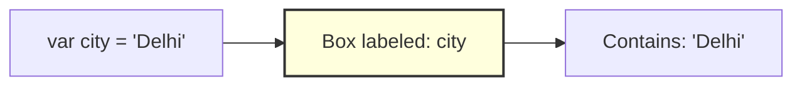
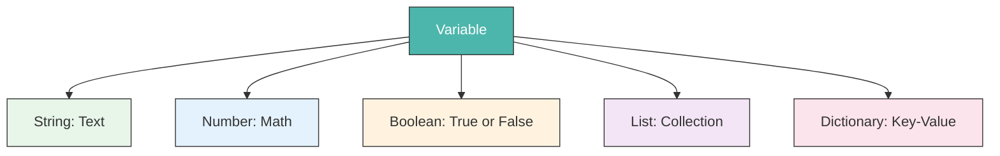

# Variables — The Storage Boxes of Programming

A **variable** is like a labeled storage box. You put something inside it, give the box a name, and then use that name whenever you need the contents.



---

## Declaring a Variable

=== "JavaScript"
    ```javascript
    // Create a variable called 'city' and store the text 'Delhi'
    var city = 'Delhi';

    // Create a variable called 'population' and store a number
    var population = 32941000;

    // Print both variables to the console
    print('City:', city);
    print('Population:', population);
    ```

=== "Python"
    ```python
    # Create a variable called 'city' and store the text 'Delhi'
    city = 'Delhi'

    # Create a variable called 'population' and store a number
    population = 32941000

    # Print both variables
    print('City:', city)
    print('Population:', population)
    ```

---

## Types of Variables

Every value has a **type**. Think of this as the shape of the storage box—it determines what fits inside.

| Type | Example | What it holds |
| :--- | :--- | :--- |
| **String** | `'Hello'` | Text / words |
| **Number** | `42`, `3.14` | Integers and decimals |
| **Boolean** | `true` / `false` | Yes/No decisions |
| **List** | `['A', 'B', 'C']` | An ordered collection |
| **Dictionary** | `{name: 'Delhi'}` | Key-value pairs |
| **null** | `null` | Empty / no value |



---

## How Variables Work in Google Earth Engine

In GEE, variables store not just simple text or numbers, but also complex objects like satellite images, geometries, and collections.

=== "JavaScript"
    ```javascript
    // String variable: the ID of a satellite dataset
    var datasetId = 'LANDSAT/LC08/C02/T1_L2';

    // Number variable: minimum cloud cover percentage
    var maxCloud = 20;

    // GEE Object variable: a filtered ImageCollection
    var collection = ee.ImageCollection(datasetId)
      .filterDate('2023-01-01', '2023-12-31')
      .filter(ee.Filter.lt('CLOUD_COVER', maxCloud));

    print('Images found:', collection.size());
    ```

=== "Python"
    ```python
    # String variable: the ID of a satellite dataset
    dataset_id = 'LANDSAT/LC08/C02/T1_L2'

    # Number variable: minimum cloud cover percentage
    max_cloud = 20

    # GEE Object variable: a filtered ImageCollection
    collection = ee.ImageCollection(dataset_id) \
        .filterDate('2023-01-01', '2023-12-31') \
        .filter(ee.Filter.lt('CLOUD_COVER', max_cloud))

    print('Images found:', collection.size().getInfo())
    ```

---

## Updating a Variable

You can change the contents of a box at any time.

=== "JavaScript"
    ```javascript
    var season = 'Winter';
    print(season); // Output: Winter

    season = 'Summer'; // Update the box contents
    print(season); // Output: Summer
    ```

=== "Python"
    ```python
    season = 'Winter'
    print(season)  # Output: Winter

    season = 'Summer'  # Update the variable
    print(season)  # Output: Summer
    ```

---

## Key Rules for Naming Variables

- Names must **start with a letter** (not a number).
- No spaces — use `camelCase` (JS) or `snake_case` (Python).
- Names are **case-sensitive**: `myVar` ≠ `myvar`.

!!! tip "Best Practice"
    Give your variables meaningful names. `cloudCover` is better than `x`. Your future self will thank you!
