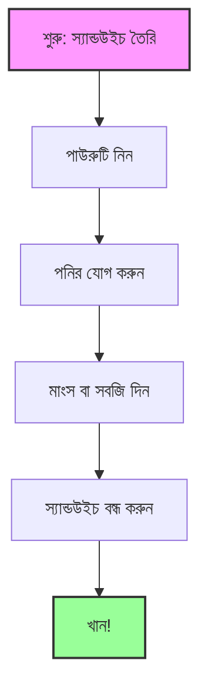
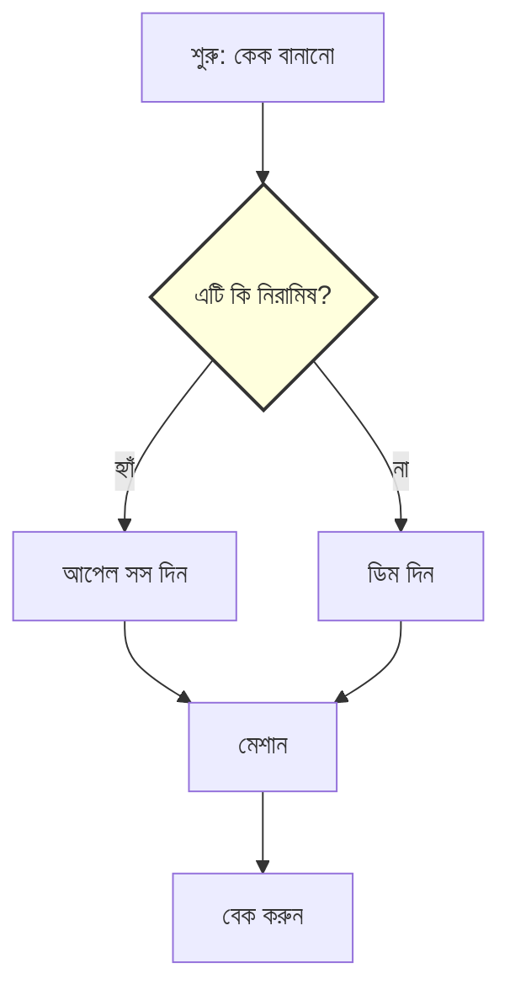

# প্রোগ্রামিং কী? (What is Programming?)

প্রোগ্রামিং শুনতে ভয়ংকর মনে হতে পারে, কিন্তু এটি আপনার ভাবনার চেয়ে অনেক সহজ।
সহজ কথায়, **প্রোগ্রামিং হলো কম্পিউটারকে নির্দেশ দেওয়া।**

## রেসিপির সাথে তুলনা (The Recipe Analogy)

কম্পিউটারকে একজন **শেফ (Chef)** হিসেবে ভাবুন যিনি খুব দ্রুত কাজ করেন, কিন্তু খুব একটা বুদ্ধিমান নন। কেক তৈরি করার জন্য তার সুনির্দিষ্ট নির্দেশনার প্রয়োজন।

*একটি প্রোগ্রাম হলো এই রেসিপির মতো ধাপগুলোর একটি ফ্লোচার্ট মাত্র।*

আপনি যদি কোনো বন্ধুকে বলেন "একটি স্যান্ডউইচ বানাও," তারা জানে কী করতে হবে।
কিন্তু কম্পিউটারকে বলতে হলে আপনাকে উপরের মতো প্রতিটি ধাপ আলাদাভাবে বলতে হবে।

**প্রোগ্রামিং হলো কম্পিউটার বুঝতে পারে এমন ভাষায় সেই রেসিপিটি লেখা।**

---

## প্রোগ্রামিং-এর প্রধান অংশগুলো

রেসিপিতে যেমন উপকরণ এবং ধাপ থাকে, কোডিং-এ থাকে **ডেটা (Data)** এবং **লজিক (Logic)**।

### ১. ভ্যারিয়েবল বা চলক (Variables - উপকরণ)

ভ্যারিয়েবল হলো এমন পাত্র যা তথ্য ধারণ করে।

*ভ্যারিয়েবলকে লেগো ব্রিকস-এর সাথে তুলনা করতে পারেন। আপনি এগুলো জমা করতে পারেন, স্তূপ করে রাখতে পারেন এবং নতুন কিছু তৈরি করতে পারেন।*

- **স্ট্রিং (String)**: লেখা বা টেক্সট (যেমন, "Hello World")
- **নাম্বার (Number)**: গণিত বা সংখ্যা (যেমন, 42, 3.14)
- **লিস্ট (List)**: অনেকগুলো জিনিসের সংগ্রহ (যেমন, `['Apple', 'Banana', 'Cherry']`)

### ২. ফাংশন (Functions - সরঞ্জাম)

একটি ফাংশন হলো একটি "মিনি-রেসিপি"। প্রতিবার "ময়দা, চিনি এবং ডিম মেশান" না লিখে আপনি `MakeDough()` নামে একটি ফাংশন তৈরি করতে পারেন।

গুগল আর্থ ইঞ্জিন-এ আমরা সবকিছুর জন্য ফাংশন ব্যবহার করি:

- `Map.addLayer()` কম্পিউটারকে কিছু একটা **আঁকতে** বা ম্যাপে দেখাতে বলে।
- `image.clip()` কম্পিউটারকে একটি ছবি **কাটতে** বলে।

### ৩. লজিক (Logic - সিদ্ধান্ত)

মাঝে মাঝে রেসিপি পরিবর্তিত হয়। "যদি এটি নিরামিষ হয়, তবে ডিম বাদ দিন।"

*কম্পিউটার হ্যাঁ/না প্রশ্নের ভিত্তিতে পথ অনুসরণ করে। একেই বলা হয় লজিক।*

---

## কেন গুগল আর্থ ইঞ্জিন?

সাধারণত প্রোগ্রামিং করতে গেলে অনেক জটিল সফটওয়্যার সেটআপ করতে হয়।
**গুগল আর্থ ইঞ্জিন আলাদা।**

- এটি আপনার ব্রাউজারে চলে (Chrome/Firefox)।
- আপনাকে কিছু ইনস্টল করতে হবে না।
- আপনি এমন **ফাংশন** ব্যবহার করেন যা গুগল আগেই আপনার জন্য লিখে রেখেছে (যেমন "Cloud Masking" বা "Calculate NDVI")।

আপনি একজন **হেড শেফ** হিসেবে কাজ করেন, এই শক্তিশালী সরঞ্জামগুলোকে ব্যবহার করে অসাধারণ সব ম্যাপ তৈরি করেন!
