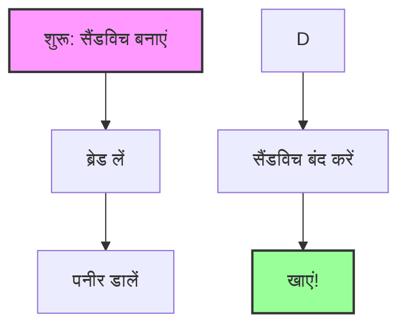
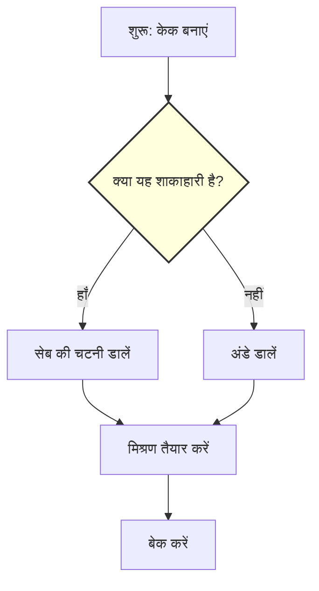

# प्रोग्रामिंग क्या है? (What is Programming?)

प्रोग्रामिंग सुनने में डरावना लग सकता है, लेकिन यह आपकी सोच से कहीं अधिक सरल है।
आसान शब्दों में, **प्रोग्रामिंग बस कंप्यूटर को निर्देश (instructions) देना है।**

## रेसिपी का उदाहरण (The Recipe Analogy)

कंप्यूटर को एक **शेफ (Chef)** की तरह समझें जो बहुत तेज़ है, लेकिन बहुत बुद्धिमान नहीं है। केक बनाने के लिए उसे बिल्कुल सटीक निर्देशों की आवश्यकता होती है।

*एक प्रोग्राम बस इन चरणों का एक फ्लोचार्ट है, जैसे यह रेसिपी।*

यदि आप किसी मित्र से कहते हैं "सैंडविच बनाओ," तो वे जानते हैं कि क्या करना है।
लेकिन अगर आप कंप्यूटर को बताते हैं, तो आपको ऊपर की तरह हर एक चरण को विस्तार से बताना होगा।

**प्रोग्रामिंग केवल उस रेसिपी को एक ऐसी भाषा में लिखना है जिसे कंप्यूटर समझ सके।**

---

## प्रोग्रामिंग के मुख्य भाग

जैसे रेसिपी में सामग्री (ingredients) और चरण होते हैं, वैसे ही कोड में **डेटा (Data)** और **लॉजिक (Logic)** होता है।

### 1. वेरिएबल्स (Variables - सामग्री)

वेरिएबल्स वे कंटेनर हैं जो जानकारी रखते हैं।

*वेरिएबल्स को लेगो ब्रिक्स की तरह समझें। आप उन्हें स्टोर कर सकते हैं, उन्हें जोड़ सकते हैं और नई चीजें बना सकते हैं।*

- **स्ट्रिंग (String)**: टेक्स्ट या शब्द (जैसे, "Hello World")
- **नंबर (Number)**: गणित या संख्या (जैसे, 42, 3.14)
- **लिस्ट (List)**: कई चीजों का संग्रह (जैसे, `['Apple', 'Banana', 'Cherry']`)

### 2. फ़ंक्शंस (Functions - औजार)

एक फ़ंक्शन एक "मिनी-रेसिपी" है। हर बार "आटा, चीनी और अंडे मिलाएं" लिखने के बजाय, आप `MakeDough()` नामक एक फ़ंक्शन बनाते हैं।

गूगल अर्थ इंजन में, हम हर चीज़ के लिए फ़ंक्शंस का उपयोग करते हैं:

- `Map.addLayer()` कंप्यूटर को कुछ **ड्रॉ (Draw)** करने के लिए कहता है।
- `image.clip()` कंप्यूटर को छवि को **काटने (Cut)** के लिए कहता है।

### 3. लॉजिक (Logic - निर्णय)

कभी-कभी रेसिपी बदल जाती है। "अगर यह शाकाहारी है, तो अंडे छोड़ दें।"

*कंप्यूटर हाँ/नहीं वाले सवालों के आधार पर काम करता है। इसे लॉजिक कहा जाता है।*

---

## गूगल अर्थ इंजन ही क्यों?

आमतौर पर, प्रोग्रामिंग के लिए जटिल सॉफ़्टवेयर सेटअप करने की आवश्यकता होती है।
**गूगल अर्थ इंजन अलग है।**

- यह आपके ब्राउज़र (Chrome/Firefox) में चलता है।
- आपको कुछ भी इंस्टॉल करने की ज़रूरत नहीं है।
- आप उन **फ़ंक्शंस** का उपयोग करते हैं जो गूगल ने पहले ही आपके लिए लिख रखे हैं (जैसे "Cloud Masking" या "Calculate NDVI")।

आप एक **हेड शेफ** के रूप में काम करते हैं, इन शक्तिशाली टूल्स को जोड़कर अद्भुत मानचित्र बनाते हैं!
