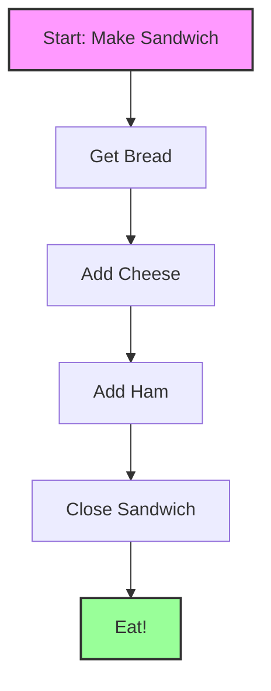
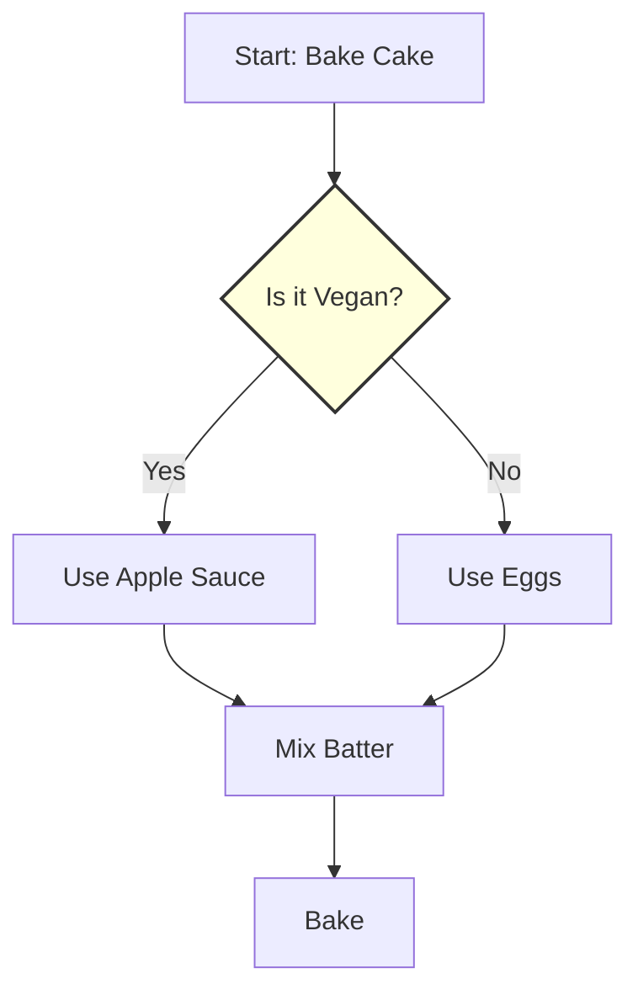

# What is Programming?

Programming sounds scary, but it's simpler than you think.
At its core, **programming is just giving instructions.**

## The Recipe Analogy

Think of a computer as a **Chef** who is very fast, but not very smart. It needs exact instructions to bake a cake.

*A program is just a flowchart of steps, like this recipe.*

If you tell a friend "Make a sandwich," they know what to do.
If you tell a computer, you have to list every single step like above.

**Programming is simply writing that recipe in a language the computer understands.**

---

## Key Parts of Programming

Just like recipes have ingredients and steps, code has **Data** and **Logic**.

### 1. Variables (The Ingredients)

Variables are containers that hold information.

*Think of variables as Lego bricks. You can store them, stack them, and build new things.*

- **String**: Text (e.g., "Hello World")
- **Number**: Math (e.g., 42, 3.14)
- **List**: A collection (e.g., `['Apple', 'Banana', 'Cherry']`)

### 2. Functions (The Tools)

A function is a mini-recipe. Instead of writing "Mix flour, sugar, and eggs" every time, you create a function called `MakeDough()`.

In Google Earth Engine, we use functions for everything:

- `Map.addLayer()` tells the computer to **Draw** something.
- `image.clip()` tells the computer to **Cut** an image.

### 3. Logic (The Decisions)

Sometimes the recipe changes. "IF it is vegan, THEN skip the eggs."

*Computers follow paths based on Yes/No questions. This is called Logic.*

---

## Why Google Earth Engine?

Usually, programming involves setting up complex software.
**Google Earth Engine is different.**

- It runs in your browser (Chrome/Firefox).
- You don't need to install anything.
- You use **functions** that Google already wrote for you (like "Cloud Masking" or "Calculate NDVI").

You act as the **Head Chef**, sequencing these powerful tools to create amazing maps!
