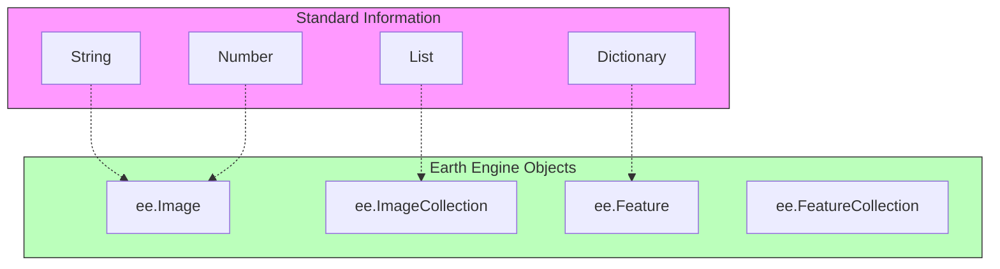

# ডেটা টাইপ বোঝা (Understanding Data Types)

একটি রেসিপিতে যেমন ময়দা, চিনি এবং ডিম থাকে, প্রোগ্রামিংয়েও তেমনি সুনির্দিষ্ট ধরণের উপকরণ থাকে। একটি কম্পিউটার "ময়দা" এর ওপর কাজ করতে পারে না যতক্ষণ না সে জানে যে এটি একটি "পাউডার"।

গুগল আর্থ ইঞ্জিন-এ, আমরা মানচিত্র বা ম্যাপের জন্য ডিজাইন করা কিছু বিশেষ ধরণের ডেটা ব্যবহার করি।

## বেসিক টাইপ (সাধারণ প্রোগ্রামিং)

এগুলো জাভাস্ক্রিপ্ট এবং পাইথন উভয়ের ক্ষেত্রেই সাধারণ।

১. **স্ট্রিং (String)**: টেক্সট বা লেখা (সবসময় উদ্ধৃতি চিহ্নের ভিতরে থাকে)।

- `'Hello World'`
- `'LANDSAT/LC08/C02/T1_L2'`

২. **নাম্বার (Number)**: গণিতের জন্য ব্যবহৃত মান।

- `42` (পূর্ণসংখ্যা বা Integer)
- `3.14` (দশমিক সংখ্যা বা Float)

৩. **লিস্ট (List)**: অনেকগুলো জিনিসের সংগ্রহ (থার্ড ব্র্যাকেট বা Square Brackets-এর মধ্যে থাকে)।

- `['Apples', 'Bananas', 'Cherries']`
- `[1, 2, 3]`

৪. **ডিকশনারি (Dictionary - জাভাস্ক্রিপ্টে একে Object বলা হয়)**: কী-ভ্যালু (Key-Value) জোড়া (আপনার ফোনের অ্যাড্রেস বুকের মতো)।

- `{'name': 'Paris', 'population': 2161000}`
- `{'color': 'red', 'size': 10}`

---

## আর্থ ইঞ্জিন টাইপ (জিও-স্প্যাশিয়াল)

এগুলো হলো স্যাটেলাইট ডেটা প্রসেস করার জন্য গুগলের তৈরি করা বিশেষ কন্টেইনার।

১. **ইমেজ (Image: `ee.Image`)**

- একটি একক ছবি (Raster)।
- এতে বিভিন্ন ব্যান্ড থাকে (যেমন- লাল, সবুজ, নীল, ইনফ্রারেড বা NIR)।

২. **ইমেজ কালেকশন (ImageCollection: `ee.ImageCollection`)**

- অনেকগুলো ইমেজের একটি ফোল্ডার বা সংগ্রহ।
- উদাহরণ: ২০২৩ সালে তোলা সমস্ত ল্যান্ডস্যাট ছবি।

৩. **ফিচার (Feature: `ee.Feature`)**

- তথ্য যুক্ত একটি একক আকার বা শেপ (Vector)।
- উদাহরণ: বাংলাদেশের সীমানা।

৪. **ফিচার কালেকশন (FeatureCollection: `ee.FeatureCollection`)**

- অনেকগুলো ফিচারের একটি গ্রুপ।
- উদাহরণ: বিশ্বের সমস্ত দেশের সীমানা।

---

## এটি কেন গুরুত্বপূর্ণ?

আপনি এগুলো উল্টোপাল্টা মিশিয়ে ফেলতে পারবেন না!

- আপনি একটি ফিচার দিয়ে একটি ইমেজকে **ক্লিপ (Clip)** বা কাটতে পারেন।
- আপনি একটি জিওমেট্রি দিয়ে একটি ইমেজ কালেকশনকে **ফিল্টার (Filter)** করতে পারেন।
- কিন্তু আপনি সরাসরি একটি নাম্বারের সাথে একটি ইমেজ **যোগ (Add)** করতে পারবেন না (বিশেষ ফাংশন ব্যবহার করা ছাড়া)।

এটি রান্নার মতো: আপনি ডিম ফেটাতে পারেন, কিন্তু আপনি একটি পাথর ফেটাতে পারবেন না!
