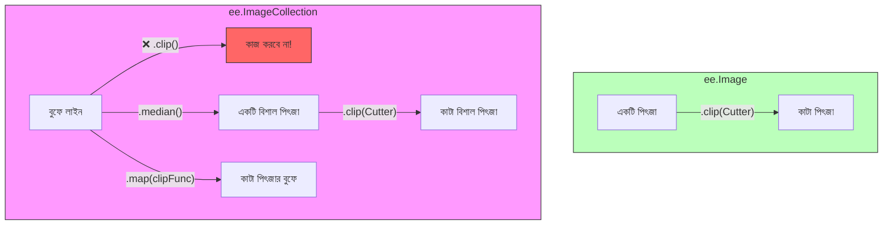

# ডেটা টাইপ বোঝা (Understanding Data Types)

একটি রেসিপিতে যেমন ময়দা, চিনি এবং ডিম থাকে, প্রোগ্রামিংয়েও তেমনি সুনির্দিষ্ট ধরণের উপকরণ থাকে। একটি কম্পিউটার "ময়দা" এর ওপর কাজ করতে পারে না যতক্ষণ না সে জানে যে এটি একটি "পাউডার"।

গুগল আর্থ ইঞ্জিন-এ, আমরা মানচিত্র বা ম্যাপের জন্য ডিজাইন করা কিছু বিশেষ ধরণের ডেটা ব্যবহার করি।

## বেসিক টাইপ (সাধারণ প্রোগ্রামিং)

এগুলো জাভাস্ক্রিপ্ট এবং পাইথন উভয়ের ক্ষেত্রেই সাধারণ।

১. **স্ট্রিং (String)**: টেক্সট বা লেখা (সবসময় উদ্ধৃতি চিহ্নের ভিতরে থাকে)।

- `'Hello World'`
- `'LANDSAT/LC08/C02/T1_L2'`

২. **নাম্বার (Number)**: গণিতের জন্য ব্যবহৃত মান।

- `42` (পূর্ণসংখ্যা বা Integer)
- `3.14` (দশমিক সংখ্যা বা Float)

৩. **লিস্ট (List)**: অনেকগুলো জিনিসের সংগ্রহ (থার্ড ব্র্যাকেট বা Square Brackets-এর মধ্যে থাকে)।

- `['Apples', 'Bananas', 'Cherries']`
- `[1, 2, 3]`

৪. **ডিকশনারি (Dictionary - জাভাস্ক্রিপ্টে একে Object বলা হয়)**: কী-ভ্যালু (Key-Value) জোড়া (আপনার ফোনের অ্যাড্রেস বুকের মতো)।

- `{'name': 'Paris', 'population': 2161000}`
- `{'color': 'red', 'size': 10}`

---

## আর্থ ইঞ্জিন রেসিপি অ্যানালজি (The Earth Engine Recipe Analogy)

আর্থ ইঞ্জিন-এ আমরা কেবল সংখ্যা নিয়ে কাজ করি না; আমরা বাস্তব জগতকে উপস্থাপন করে এমন জটিল অবজেক্ট বা জিনিস নিয়ে কাজ করি। এগুলোকে আপনার **রান্নাঘরের প্রয়োজনীয় উপকরণ (Kitchen Essentials)** হিসেবে চিন্তা করুন।

### ১. জিওমেট্রি: কুকি কাটার (Geometry: The Cookie Cutter 🍪)

একটি **জিওমেট্রি (Geometry)** কেবল একটি আকার (বিন্দু, রেখা বা বহুভুজ) ডিফাইন করে। এর মধ্যে কোনো ডেটা থাকে না—এটি কেবল "কোথায়" তা নির্ধারণ করে।

- **অ্যানালজি**: এটি একটি কুকি কাটার বা ছাঁচের মতো। এটি আপনাকে বিস্কুটের আকার কেমন হবে তা জানায়, কিন্তু এটি এখনও বিস্কুটের খামির (ডেটা) দিয়ে তৈরি নয়।
- **উদাহরণ**: `var circle = ee.Geometry.Point([0, 0]).buffer(100);`

### ২. ee.Image: তৈরি করা পিৎজা (ee.Image: The Finished Pizza 🍕)

একটি **ইমেজ (Image)** হলো একটি একক "রাস্টার" ফাইল। এটি পিক্সেলের একটি গ্রিড বা ছক।

- **অ্যানালজি**: এটি একটি তৈরি করা পিৎজা। প্রতিটি পিৎজায় ভিন্ন ভিন্ন স্তরের মতো **ব্যান্ড (Bands)** থাকে: যেমন- একটি "টমেটো" ব্যান্ড, একটি "চিজ" ব্যান্ড এবং একটি "ক্রাস্ট" ব্যান্ড।
- **উদাহরণ**: `var srtm = ee.Image("USGS/SRTMGL1_003");`

### ৩. ee.ImageCollection: পিৎজা বুফে (ee.ImageCollection: The Pizza Buffet 🍽️)

একটি **ইমেজ কালেকশন (ImageCollection)** হলো অনেকগুলো ইমেজের একটি স্তূপ বা ফোল্ডার।

- **অ্যানালজি**: এটি একটি বুফে লাইনের মতো। এখানে বিভিন্ন সময়ে (তারিখ) বা বিভিন্ন স্থানে তৈরি করা অনেক ধরণের পিৎজা (ইমেজ) সাজানো থাকে।
- **উদাহরণ**: `var landsat = ee.ImageCollection("LANDSAT/LC08/C02/T1_L2");`

### ৪. ee.Feature: লেবেলযুক্ত পার্সেল বক্স (ee.Feature: The Labeled To-Go Box 📦)

একটি **ফিচার (Feature)** হলো একটি জিওমেট্রি এবং তার সাথে যুক্ত কিছু তথ্য (মেটাডেটা)। এটি একটি একক ভেক্টর অবজেক্ট।

- **অ্যানালজি**: এটি একটি পার্সেল বা টু-গো বক্স। বক্সটির একটি নির্দিষ্ট **আকার (Geometry)** আছে এবং তার ওপর একটি **লেবেল (Properties)** সাঁটানো আছে যেখানে লেখা আছে "অর্ডার নম্বর ৪২" বা "দোকান: লন্ডন"।
- **উদাহরণ**: `var city = ee.Feature(ee.Geometry.Point([0,0]), {name: 'Center'});`

### ৫. ee.FeatureCollection: ডেলিভারি স্প্রেডশিট (ee.FeatureCollection: The Delivery Spreadsheet 📋)

একটি **ফিচার কালেকশন (FeatureCollection)** হলো অনেকগুলো ফিচারের একটি গ্রুপ।

- **অ্যানালজি**: এটি ডেলিভারি বয়-এর প্রতিদিনের স্প্রেডশিট বা তালিকার মতো। এখানে অনেকগুলো লেবেলযুক্ত বক্সের (Features) তালিকা থাকে এবং সেগুলোকে একটি টেবিলে গুছিয়ে রাখা হয়।
- **উদাহরণ**: `var countries = ee.FeatureCollection("USDOS/LSIB_SIMPLE/2017");`

---

---

## এটি কেন গুরুত্বপূর্ণ? ("ভুল সরঞ্জাম" ব্যবহারের সমস্যা)

রান্নাঘরে যেমন আপনি পিৎজা ফেটাতে পারেন না বা স্প্রেডশিট দিয়ে ডিমের কুসুম কাটতে পারেন না, আর্থ ইঞ্জিন-এর ফাংশনগুলোও কেবল সুনির্দিষ্ট "উপকরণের" ওপর কাজ করে।

### টুল কম্প্যাটিবিলিটি চার্ট (Tool Compatibility Chart)

### ১. সরাসরি সরঞ্জাম (Direct Tools - ee.Image)

আপনার কাছে যদি **মাঝি একটি ছবি (Single Image)** থাকে, তবে আপনি সরাসরি সেটির ওপর কাজ করতে পারেন।

- **উদাহরণ**: `myImage.clip(myGeometry)` — আপনি একটি কাটার দিয়ে একটি পিৎজা কাটছেন।

### ২. অ্যাসেম্বলি লাইন সরঞ্জাম (Assembly Line Tools - ee.ImageCollection)

আপনি একসাথে পুরো বুফে লাইন কাটতে পারবেন না! আপনি যদি সরাসরি `myCollection.clip()` করার চেষ্টা করেন, তবে আর্থ ইঞ্জিন আপনাকে ভুল বা এরর (Error) দেখাবে। আপনার কাছে দুটি উপায় আছে:

- **সব মিশিয়ে এক করা (Composite)**: `.median()` বা `.mean()` ব্যবহার করে পুরো কালেকশনকে **একটি ছবিতে** রূপান্তর করুন, তারপর সেটি কাটুন। 🥣
- **অ্যাসেম্বলি লাইন (Map)**: `.map()` ব্যবহার করে আর্থ ইঞ্জিনকে বলুন: "এই বুফেতে থাকা প্রতিটি পিৎজা একটি একটি করে নাও এবং সেগুলো কাটো।" 🧺

**মনে রাখবেন**: আপনি একটি কালেকশনকে `.filter()` করতে পারেন, কিন্তু একটি একক ছবিকে `.filter()` করতে পারেন না। আবার আপনি একটি ছবিকে সরাসরি `.clip()` করতে পারেন, কিন্তু একটি কালেকশনকে সরাসরি `.clip()` করতে পারবেন না (অ্যাসেম্বলি লাইন বা `.map()` ছাড়া)।
