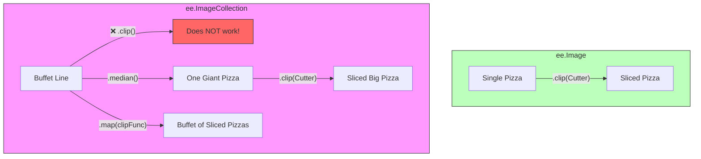

# Understanding Data Types (The Ingredients)

Just like a recipe has flour, sugar, and eggs, programming has strictly defined types of ingredients.
A computer cannot act on "flour" unless it knows it's a "Powder".

In Google Earth Engine, we use special types designed for maps.

## Basic Types (Standard Programming)

These are common to both JavaScript and Python.

1. **String**: Text (always in quotes).
   - `'Hello World'`
   - `'LANDSAT/LC08/C02/T1_L2'`

2. **Number**: Values for math.
   - `42` (Integer)
   - `3.14` (Decimal/Float)

3. **List**: A collection of items (in square brackets).
   - `['Apples', 'Bananas', 'Cherries']`
   - `[1, 2, 3]`

4. **Dictionary (Object in JS)**: Key-Value pairs (like an address book).
   - `{'name': 'Paris', 'population': 2161000}`
   - `{'color': 'red', 'size': 10}`

---

## The Earth Engine Recipe Analogy

In Earth Engine, we don't just work with numbers; we work with complex objects that represent the real world. Think of these as your **Kitchen Essentials**.

### 1. Geometry: The Cookie Cutter 🍪

A **Geometry** defines a shape (point, line, or polygon). It has NO data—it just defines the "where".

- **Analogy**: It's like a cookie cutter. It tells you the shape of the cookie, but it's not made of dough yet.
- **Example**: `var circle = ee.Geometry.Point([0, 0]).buffer(100);`

### 2. ee.Image: The Finished Pizza 🍕

An **Image** is a single "raster" file. It represents a grid of pixels.

- **Analogy**: It's a single pizza. Each pizza has different **Bands** like layers: a "Tomato" band, a "Cheese" band, and a "Crust" band.
- **Example**: `var srtm = ee.Image("USGS/SRTMGL1_003");`

### 3. ee.ImageCollection: The Pizza Buffet 🍽️

An **ImageCollection** is a stack or folder of many images.

- **Analogy**: It's a buffet line. You have many different pizzas (images) coming out at different times (dates) or locations.
- **Example**: `var landsat = ee.ImageCollection("LANDSAT/LC08/C02/T1_L2");`

### 4. ee.Feature: The Labeled To-Go Box 📦

A **Feature** is a Geometry plus some data (metadata). It represents a single vector object.

- **Analogy**: It's a to-go box. The box has a specific **Shape** (Geometry), and a **Label** (Properties) written on it like "Order #42" or "Store: London".
- **Example**: `var city = ee.Feature(ee.Geometry.Point([0,0]), {name: 'Center'});`

### 5. ee.FeatureCollection: The Delivery Spreadsheet 📋

A **FeatureCollection** is a group of features.

- **Analogy**: It's the daily delivery spreadsheet. It lists many labeled boxes (Features) and keeps them organized in a table.
- **Example**: `var countries = ee.FeatureCollection("USDOS/LSIB_SIMPLE/2017");`

---

---

## Why does this matter? (The "Wrong Tool" Error)

Just like you can't whisk a pizza or slice an egg yolk with a spreadsheet, Earth Engine functions only work on specific "Ingredients".

### Tool Compatibility Chart

### 1. Direct Tools (ee.Image)

If you have **one single image**, you can use tools directly on it.

- **Example**: `myImage.clip(myGeometry)` — You are cutting one pizza with one cutter.

### 2. Assembly Line Tools (ee.ImageCollection)

You **cannot** slice a whole buffet line at once! If you try `myCollection.clip()`, Earth Engine will give you an error. You have two choices:

- **The "Big Smash" (Composite)**: Use `.median()` or `.mean()` to turn the entire collection into **one single image**, then clip it. 🥣
- **The "Assembly Line" (Map)**: Use `.map()` to tell GEE: "Take every pizza in this buffet, one by one, and clip it." 🧺

**Remember**: You can `.filter()` a collection, but you can't `.filter()` a single image. You can `.clip()` a single image, but you can't `.clip()` a collection without an assembly line (`.map()`).
