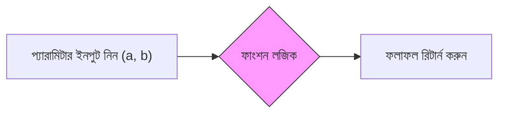

# ফাংশন নিয়ে কাজ করা (Working with Functions)

একটি **ফাংশন (Function)** অনেকটা একটি "মিনি-রেসিপি"-র মতো। প্রতিবার "ময়দা, চিনি এবং ডিম মেশান" না লিখে আপনি `MakeDough()` নামে একটি ফাংশন তৈরি করতে পারেন।

## ফাংশন কেন ব্যবহার করবেন?

এগুলো সময় বাঁচায়! একই কথা বারবার না লিখে, আপনি একবার আপনার লজিকটি লেখেন এবং পরে সেটা বারবার ব্যবহার করতে পারেন।

## উদাহরণ: একটি সাধারণ ক্যালকুলেটর (A Simple Calculator)



চলুন এমন একটি ফাংশন তৈরি করি যা দুটি সংখ্যা যোগ করে।

=== "JavaScript"
    ```javascript
    // ফাংশনটি ডিফাইন বা তৈরি করুন
    var addNumbers = function(a, b) {
      return a + b;
    };

    // এটি ব্যবহার করুন!
    var result = addNumbers(5, 10);
    print(result); // আউটপুট: 15
    ```

=== "Python"
    ```python
    # ফাংশনটি ডিফাইন বা তৈরি করুন
    def add_numbers(a, b):
      return a + b

    # এটি ব্যবহার করুন!
    result = add_numbers(5, 10)
    print(result) # আউটপুট: 15
    ```

---

## উদাহরণ: ক্লাউড মাস্কিং ফাংশন (বাস্তব উদাহরণ)

আর্থ ইঞ্জিন-এ আমরা প্রধানত ম্যাপ থেকে **মেঘ সরাতে (hide clouds)** ফাংশন ব্যবহার করি। এই ফাংশনটি মেঘযুক্ত একটি ইমেজকে নেয় এবং একটি পরিষ্কার ইমেজ ফিরিয়ে দেয়।

=== "JavaScript"
    ```javascript
    // ফাংশনটি ডিফাইন বা তৈরি করুন
    var maskClouds = function(image) {
      // QA ব্যান্ড ব্যবহার করে মেঘ খুঁজে বের করুন
      var qa = image.select('QA_PIXEL');
      var cloudMask = qa.bitwiseAnd(1 << 3).eq(0); // জটিল লজিক এখানে লুকানো আছে!

      // মাস্ক আপডেট করুন (মেঘ ঢেকে দিন)
      return image.updateMask(cloudMask);
    };
    
    // এখন যে কোনো ইমেজে এটি ব্যবহার করুন!
    var cleanImage = maskClouds(cloudyImage);
    ```

=== "Python"
    ```python
    # ফাংশনটি ডিফাইন বা তৈরি করুন
    def mask_clouds(image):
      # QA ব্যান্ড ব্যবহার করে মেঘ খুঁজে বের করুন
      qa = image.select('QA_PIXEL')
      cloud_mask = qa.bitwiseAnd(1 << 3).eq(0) # জটিল লজিক এখানে লুকানো আছে!

      # মাস্ক আপডেট করুন (মেঘ ঢেকে দিন)
      return image.updateMask(cloud_mask)
    
    # এখন যে কোনো ইমেজে এটি ব্যবহার করুন!
    clean_image = mask_clouds(cloudy_image)
    ```

## প্রো টিপ (Pro Tip)

আপনার ফাংশনগুলো সহজ রাখুন। একটি ফাংশনের কেবল **একটি নির্দিষ্ট কাজ নিখুঁতভাবে** করা উচিত।
