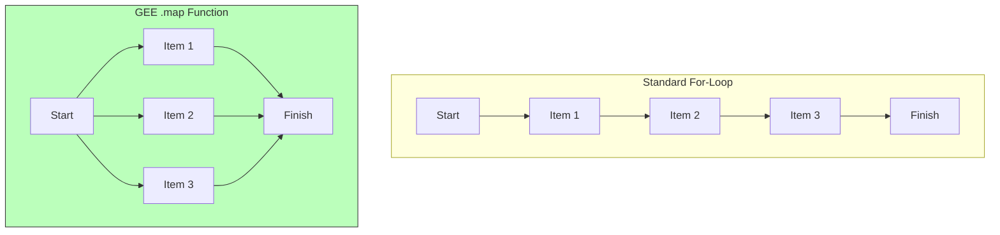

# লুপ (Loops): বারবার একই কাজ করা (Doing Things Again and Again)

কল্পনা করুন আপনি এক বছরের **প্রতিটি** দিনের জন্য NDVI গণনা করতে চান। ৩৬৫ বার কোড লেখা খুবই বিরক্তিকর। এজন্যই আমরা **লুপ (Loops)** ব্যবহার করি।

সাধারণ প্রোগ্রামিংয়ে আপনি হয়তো এভাবে কোড লিখতেন: "১ম দিনের জন্য এটি করো। ২য় দিনের জন্য এটি করো।"

## `map()` ফাংশন (আর্থ ইঞ্জিন-এর লুপ)

গুগল আর্থ ইঞ্জিন-এ আমরা `.map()` নামে একটি বিশেষ ধরণের লুপ ব্যবহার করি। এটিকে একটি **অ্যাসেম্বলি লাইন (Assembly Line)** হিসেবে চিন্তা করুন।

১. আপনি একটি প্রধান নির্দেশিকা (একটি ফাংশন) তৈরি করেন।
২. আপনি অনেকগুলো জিনিসের একটি সংগ্রহ (যেমন- ইমেজ কালেকশন) এই লাইনে পাঠিয়ে দেন।
৩. কম্পিউটার প্রতিটি জিনিসের ওপর **একই সময়ে (at the same time)** সেই নির্দেশিকাটি প্রয়োগ করে।



## উদাহরণ: অ্যাসেম্বলি লাইন

ধরে নিন আমাদের কাছে ১০টি আপেলের একটি বক্স (`ImageCollection`) আছে এবং আমরা সেগুলো খোসা ছাড়াতে (`Function`) চাই।

=== "JavaScript"
    ```javascript
    // সংগ্রহ বা কালেকশন: ৩ বছরের ইমেজ
    var collection = ee.ImageCollection('LANDSAT/LC08/C02/T1_L2');

    // নির্দেশিকা: একটি ইমেজের জন্য NDVI গণনা করা
    var addNDVI = function(image) {
      return image.normalizedDifference(['SR_B5', 'SR_B4']);
    };
    
    // লুপ: সমস্ত ইমেজের ওপর নির্দেশিকাটি প্রয়োগ করুন
    var processedCollection = collection.map(addNDVI);
    ```

=== "Python"
    ```python
    # সংগ্রহ বা কালেকশন: ৩ বছরের ইমেজ
    collection = ee.ImageCollection('LANDSAT/LC08/C02/T1_L2')

    # নির্দেশিকা: একটি ইমেজের জন্য NDVI গণনা করা
    def add_ndvi(image):
      return image.normalizedDifference(['SR_B5', 'SR_B4'])
    
    # লুপ: সমস্ত ইমেজের ওপর নির্দেশিকাটি প্রয়োগ করুন
    processed_collection = collection.map(add_ndvi)
    ```

## `for` লুপের বদলে কেন `.map()` ব্যবহার করবেন?

সাধারণ `for` লুপ আপনার কম্পিউটারে চলে (Client-side)।
অন্যদিকে, `.map()` চলে গুগলের সুপারকম্পিউটারে (Server-side)। হাজার হাজার স্যাটেলাইট ইমেজ প্রসেস করার জন্য এটি **অনেক গুণ বেশি দ্রুত**।
