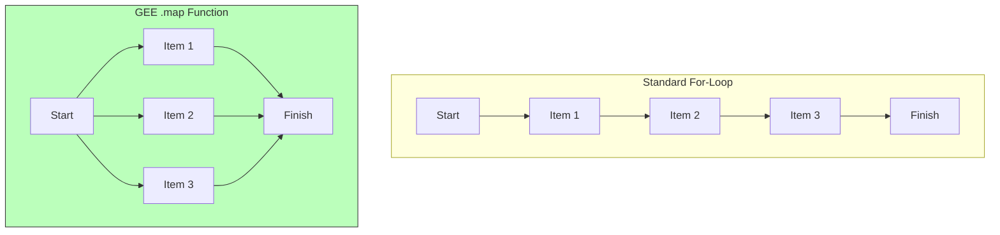

# Loops (Doing Things Again and Again)

Imagine you want to calculate the NDVI for **every** day in a year.
Writing code 365 times is boring. That’s why we use **Loops**.

In standard programming, you might write code like: "For Day 1, do this. For Day 2, do this."

## The `map()` Function (Earth Engine's Loop)

In Google Earth Engine, we use a special kind of loop called `.map()`.
Think of it as an **Assembly Line**.

1. You create a master instruction (a Function).
2. You feed a collection of items (Images) into the line.
3. The computer applies the instruction to every item **at the same time**.



## Example: The Assembly Line

Let's assume we have a box of 10 apples (`ImageCollection`) and we want to peel them (`Function`).

=== "JavaScript"
    ```javascript
    // The collection: 3 years of images
    var collection = ee.ImageCollection('LANDSAT/LC08/C02/T1_L2');

    // The instruction: Calculate NDVI for one image
    var addNDVI = function(image) {
      return image.normalizedDifference(['SR_B5', 'SR_B4']);
    };
    
    // The loop: Apply instruction to all images
    var processedCollection = collection.map(addNDVI);
    ```

=== "Python"
    ```python
    # The collection: 3 years of images
    collection = ee.ImageCollection('LANDSAT/LC08/C02/T1_L2')

    # The instruction: Calculate NDVI for one image
    def add_ndvi(image):
      return image.normalizedDifference(['SR_B5', 'SR_B4'])
    
    # The loop: Apply instruction to all images
    processed_collection = collection.map(add_ndvi)
    ```

## Why `.map()` instead of `for` loops?

Standard `for` loops run on your computer (Client-side).
`.map()` runs on Google's supercomputers (Server-side). It is **much faster** for processing thousands of satellite images.
